Durata della stagione
================
Dr. Raffaele Morelli
27 ottobre, 2023 - 14:25

- [Grafici](#grafici)
  - [ITC43 Lecco](#itc43-lecco)
  - [ITC42 Como](#itc42-como)
  - [ITC44 Sondrio](#itc44-sondrio)
  - [ITC46 Bergamo](#itc46-bergamo)
  - [ITC47 Brescia](#itc47-brescia)
  - [ITH33 Belluno](#ith33-belluno)
  - [ITC13 Biella](#itc13-biella)
  - [ITH41 Pordenone](#ith41-pordenone)
  - [ITH42 Udine](#ith42-udine)
  - [ITF11 L’Aquila](#itf11-laquila)
  - [ITC11 Torino](#itc11-torino)
  - [ITC14 Verbano-Cusio-Ossola](#itc14-verbano-cusio-ossola)
  - [ITC12 Vercelli](#itc12-vercelli)
  - [ITC16 Cuneo](#itc16-cuneo)
  - [ITC20 Valle d’Aosta/Vallée
    d’Aoste](#itc20-valle-daostavallãe-daoste)
  - [ITH10 Bolzano-Bozen](#ith10-bolzano-bozen)
  - [ITH20 Trento](#ith20-trento)
- [Modello lineare](#modello-lineare)
  - [ITC43 Lecco](#itc43-lecco-1)
  - [ITC42 Como](#itc42-como-1)
  - [ITC44 Sondrio](#itc44-sondrio-1)
  - [ITC46 Bergamo](#itc46-bergamo-1)
  - [ITC47 Brescia](#itc47-brescia-1)
  - [ITH33 Belluno](#ith33-belluno-1)
  - [ITC13 Biella](#itc13-biella-1)
  - [ITH41 Pordenone](#ith41-pordenone-1)
  - [ITH42 Udine](#ith42-udine-1)
  - [ITF11 L’Aquila](#itf11-laquila-1)
  - [ITC11 Torino](#itc11-torino-1)
  - [ITC14 Verbano-Cusio-Ossola](#itc14-verbano-cusio-ossola-1)
  - [ITC12 Vercelli](#itc12-vercelli-1)
  - [ITC16 Cuneo](#itc16-cuneo-1)
  - [ITC20 Valle d’Aosta/Vallée
    d’Aoste](#itc20-valle-daostavallãe-daoste-1)
  - [ITH10 Bolzano-Bozen](#ith10-bolzano-bozen-1)
  - [ITH20 Trento](#ith20-trento-1)

# Grafici

## ITC43 Lecco

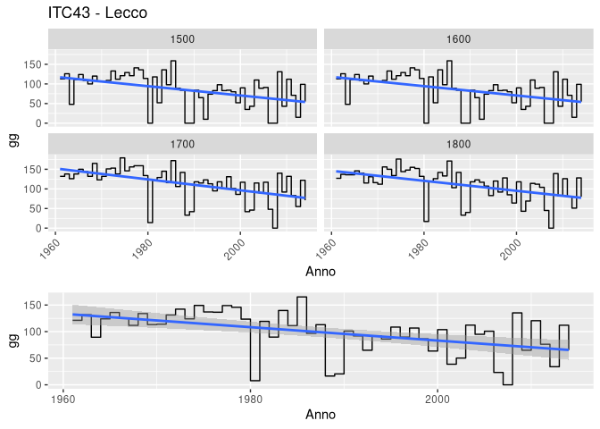<!-- -->

## ITC42 Como

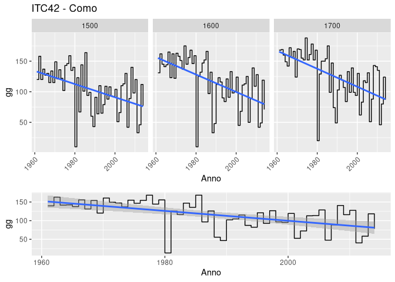<!-- -->

## ITC44 Sondrio

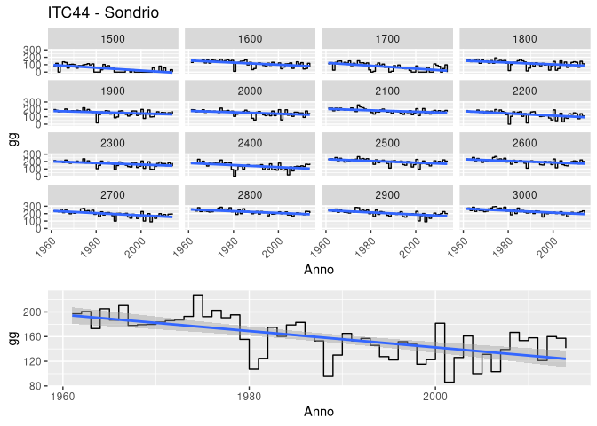<!-- -->

## ITC46 Bergamo

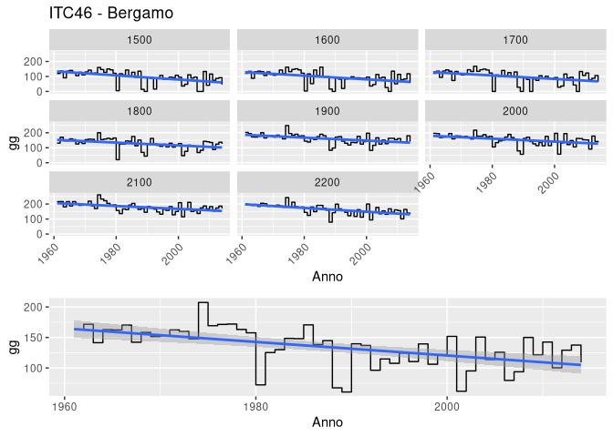<!-- -->

## ITC47 Brescia

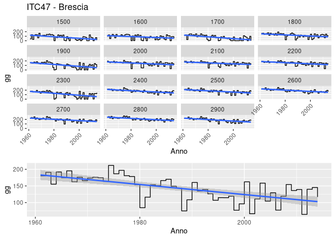<!-- -->

## ITH33 Belluno

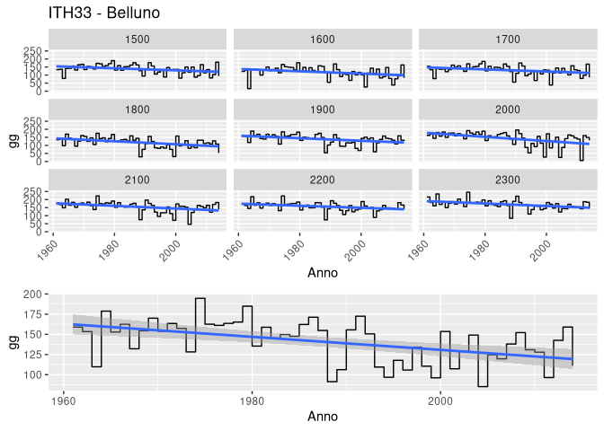<!-- -->

## ITC13 Biella

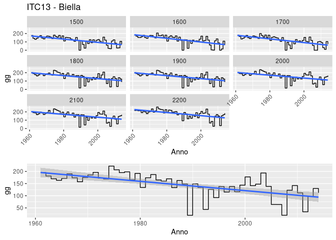<!-- -->

## ITH41 Pordenone

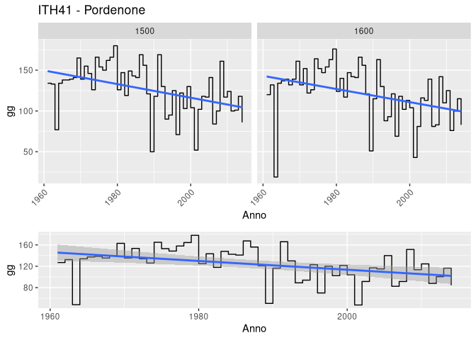<!-- -->

## ITH42 Udine

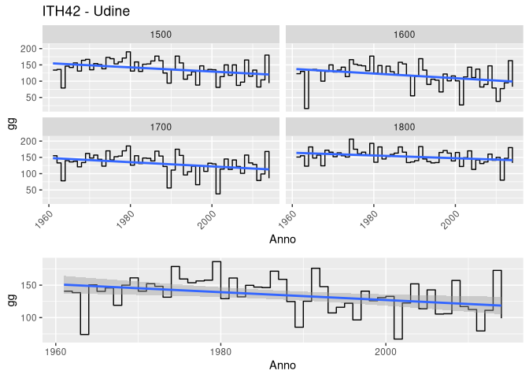<!-- -->

## ITF11 L’Aquila

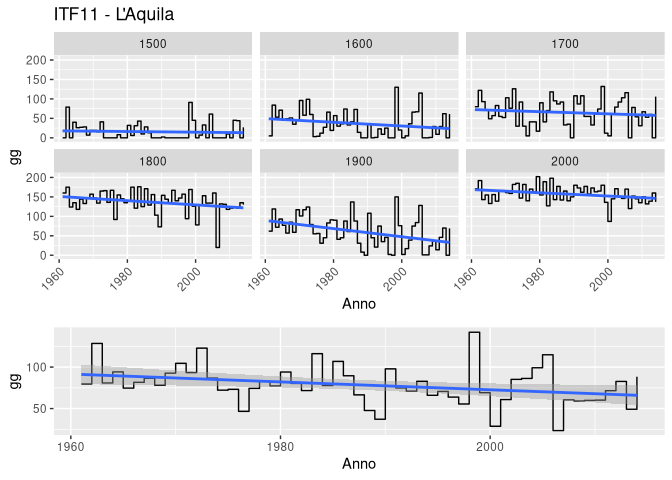<!-- -->

## ITC11 Torino

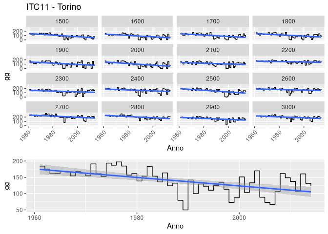<!-- -->

## ITC14 Verbano-Cusio-Ossola

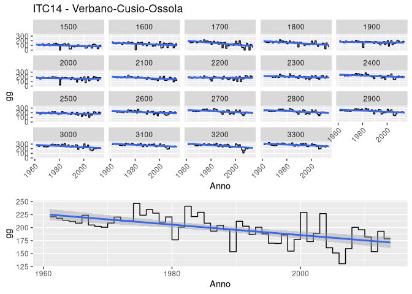<!-- -->

## ITC12 Vercelli

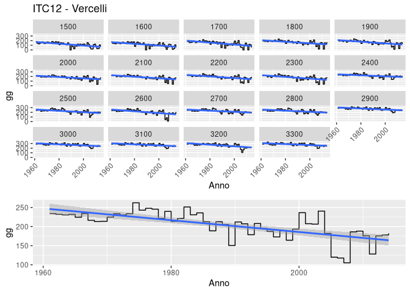<!-- -->

## ITC16 Cuneo

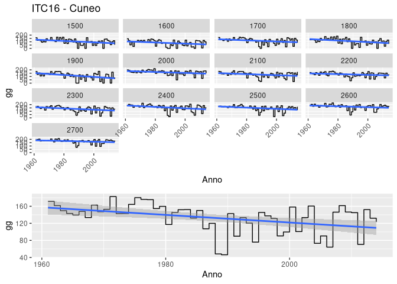<!-- -->

## ITC20 Valle d’Aosta/Vallée d’Aoste

<!-- -->

## ITH10 Bolzano-Bozen

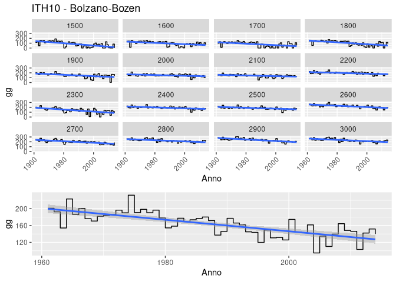<!-- -->

## ITH20 Trento

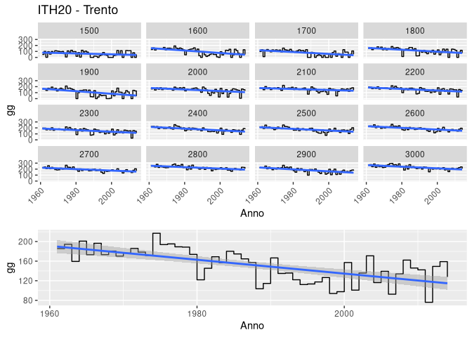<!-- -->

# Modello lineare

## ITC43 Lecco

R² : 0.5866756

adjusted R² : 0.5788657

<table>
<thead>
<tr>
<th style="text-align:left;">
term
</th>
<th style="text-align:right;">
estimate
</th>
<th style="text-align:right;">
std.error
</th>
<th style="text-align:right;">
statistic
</th>
<th style="text-align:right;">
p.value
</th>
</tr>
</thead>
<tbody>
<tr>
<td style="text-align:left;">
(Intercept)
</td>
<td style="text-align:right;">
1884.7644393
</td>
<td style="text-align:right;">
157.5680631
</td>
<td style="text-align:right;">
11.9615892
</td>
<td style="text-align:right;">
0.0000000
</td>
</tr>
<tr>
<td style="text-align:left;">
quota700
</td>
<td style="text-align:right;">
0.4259259
</td>
<td style="text-align:right;">
6.2980030
</td>
<td style="text-align:right;">
0.0676287
</td>
<td style="text-align:right;">
0.9461008
</td>
</tr>
<tr>
<td style="text-align:left;">
quota800
</td>
<td style="text-align:right;">
0.0370370
</td>
<td style="text-align:right;">
6.2980030
</td>
<td style="text-align:right;">
0.0058808
</td>
<td style="text-align:right;">
0.9953096
</td>
</tr>
<tr>
<td style="text-align:left;">
quota900
</td>
<td style="text-align:right;">
-1.5925926
</td>
<td style="text-align:right;">
6.2980030
</td>
<td style="text-align:right;">
-0.2528726
</td>
<td style="text-align:right;">
0.8004422
</td>
</tr>
<tr>
<td style="text-align:left;">
quota1000
</td>
<td style="text-align:right;">
14.4259259
</td>
<td style="text-align:right;">
6.2980030
</td>
<td style="text-align:right;">
2.2905556
</td>
<td style="text-align:right;">
0.0222908
</td>
</tr>
<tr>
<td style="text-align:left;">
quota1100
</td>
<td style="text-align:right;">
37.3703704
</td>
<td style="text-align:right;">
6.2980030
</td>
<td style="text-align:right;">
5.9336857
</td>
<td style="text-align:right;">
0.0000000
</td>
</tr>
<tr>
<td style="text-align:left;">
quota1200
</td>
<td style="text-align:right;">
32.2222222
</td>
<td style="text-align:right;">
6.2980030
</td>
<td style="text-align:right;">
5.1162602
</td>
<td style="text-align:right;">
0.0000004
</td>
</tr>
<tr>
<td style="text-align:left;">
quota1300
</td>
<td style="text-align:right;">
62.5740741
</td>
<td style="text-align:right;">
6.2980030
</td>
<td style="text-align:right;">
9.9355421
</td>
<td style="text-align:right;">
0.0000000
</td>
</tr>
<tr>
<td style="text-align:left;">
quota1400
</td>
<td style="text-align:right;">
59.3703704
</td>
<td style="text-align:right;">
6.2980030
</td>
<td style="text-align:right;">
9.4268565
</td>
<td style="text-align:right;">
0.0000000
</td>
</tr>
<tr>
<td style="text-align:left;">
quota1500
</td>
<td style="text-align:right;">
70.5740741
</td>
<td style="text-align:right;">
6.2980030
</td>
<td style="text-align:right;">
11.2057860
</td>
<td style="text-align:right;">
0.0000000
</td>
</tr>
<tr>
<td style="text-align:left;">
quota1600
</td>
<td style="text-align:right;">
70.5740741
</td>
<td style="text-align:right;">
6.2980030
</td>
<td style="text-align:right;">
11.2057860
</td>
<td style="text-align:right;">
0.0000000
</td>
</tr>
<tr>
<td style="text-align:left;">
quota1700
</td>
<td style="text-align:right;">
98.9814815
</td>
<td style="text-align:right;">
6.2980030
</td>
<td style="text-align:right;">
15.7163281
</td>
<td style="text-align:right;">
0.0000000
</td>
</tr>
<tr>
<td style="text-align:left;">
quota1800
</td>
<td style="text-align:right;">
96.2037037
</td>
<td style="text-align:right;">
6.2980030
</td>
<td style="text-align:right;">
15.2752712
</td>
<td style="text-align:right;">
0.0000000
</td>
</tr>
<tr>
<td style="text-align:left;">
anno
</td>
<td style="text-align:right;">
-0.9408365
</td>
<td style="text-align:right;">
0.0792479
</td>
<td style="text-align:right;">
-11.8720751
</td>
<td style="text-align:right;">
0.0000000
</td>
</tr>
</tbody>
</table>

## ITC42 Como

R² : 0.6452865

adjusted R² : 0.6385833

<table>
<thead>
<tr>
<th style="text-align:left;">
term
</th>
<th style="text-align:right;">
estimate
</th>
<th style="text-align:right;">
std.error
</th>
<th style="text-align:right;">
statistic
</th>
<th style="text-align:right;">
p.value
</th>
</tr>
</thead>
<tbody>
<tr>
<td style="text-align:left;">
(Intercept)
</td>
<td style="text-align:right;">
2081.5753367
</td>
<td style="text-align:right;">
160.7866433
</td>
<td style="text-align:right;">
12.9461956
</td>
<td style="text-align:right;">
0.0000000
</td>
</tr>
<tr>
<td style="text-align:left;">
quota700
</td>
<td style="text-align:right;">
0.4074074
</td>
<td style="text-align:right;">
6.1747151
</td>
<td style="text-align:right;">
0.0659800
</td>
<td style="text-align:right;">
0.9474146
</td>
</tr>
<tr>
<td style="text-align:left;">
quota800
</td>
<td style="text-align:right;">
4.8888889
</td>
<td style="text-align:right;">
6.1747151
</td>
<td style="text-align:right;">
0.7917594
</td>
<td style="text-align:right;">
0.4287966
</td>
</tr>
<tr>
<td style="text-align:left;">
quota900
</td>
<td style="text-align:right;">
47.2222222
</td>
<td style="text-align:right;">
6.1747151
</td>
<td style="text-align:right;">
7.6476763
</td>
<td style="text-align:right;">
0.0000000
</td>
</tr>
<tr>
<td style="text-align:left;">
quota1000
</td>
<td style="text-align:right;">
10.7037037
</td>
<td style="text-align:right;">
6.1747151
</td>
<td style="text-align:right;">
1.7334733
</td>
<td style="text-align:right;">
0.0834970
</td>
</tr>
<tr>
<td style="text-align:left;">
quota1100
</td>
<td style="text-align:right;">
40.0370370
</td>
<td style="text-align:right;">
6.1747151
</td>
<td style="text-align:right;">
6.4840298
</td>
<td style="text-align:right;">
0.0000000
</td>
</tr>
<tr>
<td style="text-align:left;">
quota1200
</td>
<td style="text-align:right;">
37.5000000
</td>
<td style="text-align:right;">
6.1747151
</td>
<td style="text-align:right;">
6.0731547
</td>
<td style="text-align:right;">
0.0000000
</td>
</tr>
<tr>
<td style="text-align:left;">
quota1300
</td>
<td style="text-align:right;">
78.9814815
</td>
<td style="text-align:right;">
6.1747151
</td>
<td style="text-align:right;">
12.7911134
</td>
<td style="text-align:right;">
0.0000000
</td>
</tr>
<tr>
<td style="text-align:left;">
quota1400
</td>
<td style="text-align:right;">
82.7777778
</td>
<td style="text-align:right;">
6.1747151
</td>
<td style="text-align:right;">
13.4059266
</td>
<td style="text-align:right;">
0.0000000
</td>
</tr>
<tr>
<td style="text-align:left;">
quota1500
</td>
<td style="text-align:right;">
89.6666667
</td>
<td style="text-align:right;">
6.1747151
</td>
<td style="text-align:right;">
14.5215876
</td>
<td style="text-align:right;">
0.0000000
</td>
</tr>
<tr>
<td style="text-align:left;">
quota1600
</td>
<td style="text-align:right;">
102.6481481
</td>
<td style="text-align:right;">
6.1747151
</td>
<td style="text-align:right;">
16.6239488
</td>
<td style="text-align:right;">
0.0000000
</td>
</tr>
<tr>
<td style="text-align:left;">
quota1700
</td>
<td style="text-align:right;">
111.7407407
</td>
<td style="text-align:right;">
6.1747151
</td>
<td style="text-align:right;">
18.0965014
</td>
<td style="text-align:right;">
0.0000000
</td>
</tr>
<tr>
<td style="text-align:left;">
anno
</td>
<td style="text-align:right;">
-1.0398609
</td>
<td style="text-align:right;">
0.0808691
</td>
<td style="text-align:right;">
-12.8585675
</td>
<td style="text-align:right;">
0.0000000
</td>
</tr>
</tbody>
</table>

## ITC44 Sondrio

R² : 0.8368798

adjusted R² : 0.8337997

<table>
<thead>
<tr>
<th style="text-align:left;">
term
</th>
<th style="text-align:right;">
estimate
</th>
<th style="text-align:right;">
std.error
</th>
<th style="text-align:right;">
statistic
</th>
<th style="text-align:right;">
p.value
</th>
</tr>
</thead>
<tbody>
<tr>
<td style="text-align:left;">
(Intercept)
</td>
<td style="text-align:right;">
2687.507744
</td>
<td style="text-align:right;">
113.2621242
</td>
<td style="text-align:right;">
23.728212
</td>
<td style="text-align:right;">
0.0000000
</td>
</tr>
<tr>
<td style="text-align:left;">
quota700
</td>
<td style="text-align:right;">
-8.518519
</td>
<td style="text-align:right;">
6.2756345
</td>
<td style="text-align:right;">
-1.357396
</td>
<td style="text-align:right;">
0.1748869
</td>
</tr>
<tr>
<td style="text-align:left;">
quota800
</td>
<td style="text-align:right;">
20.814815
</td>
<td style="text-align:right;">
6.2756345
</td>
<td style="text-align:right;">
3.316767
</td>
<td style="text-align:right;">
0.0009354
</td>
</tr>
<tr>
<td style="text-align:left;">
quota900
</td>
<td style="text-align:right;">
12.851852
</td>
<td style="text-align:right;">
6.2756345
</td>
<td style="text-align:right;">
2.047897
</td>
<td style="text-align:right;">
0.0407670
</td>
</tr>
<tr>
<td style="text-align:left;">
quota1000
</td>
<td style="text-align:right;">
17.055556
</td>
<td style="text-align:right;">
6.2756345
</td>
<td style="text-align:right;">
2.717742
</td>
<td style="text-align:right;">
0.0066586
</td>
</tr>
<tr>
<td style="text-align:left;">
quota1100
</td>
<td style="text-align:right;">
14.574074
</td>
<td style="text-align:right;">
6.2756345
</td>
<td style="text-align:right;">
2.322327
</td>
<td style="text-align:right;">
0.0203664
</td>
</tr>
<tr>
<td style="text-align:left;">
quota1200
</td>
<td style="text-align:right;">
28.425926
</td>
<td style="text-align:right;">
6.2756345
</td>
<td style="text-align:right;">
4.529570
</td>
<td style="text-align:right;">
0.0000064
</td>
</tr>
<tr>
<td style="text-align:left;">
quota1300
</td>
<td style="text-align:right;">
25.685185
</td>
<td style="text-align:right;">
6.2756345
</td>
<td style="text-align:right;">
4.092843
</td>
<td style="text-align:right;">
0.0000452
</td>
</tr>
<tr>
<td style="text-align:left;">
quota1400
</td>
<td style="text-align:right;">
57.944444
</td>
<td style="text-align:right;">
6.2756345
</td>
<td style="text-align:right;">
9.233241
</td>
<td style="text-align:right;">
0.0000000
</td>
</tr>
<tr>
<td style="text-align:left;">
quota1500
</td>
<td style="text-align:right;">
20.759259
</td>
<td style="text-align:right;">
6.2756345
</td>
<td style="text-align:right;">
3.307914
</td>
<td style="text-align:right;">
0.0009652
</td>
</tr>
<tr>
<td style="text-align:left;">
quota1600
</td>
<td style="text-align:right;">
93.777778
</td>
<td style="text-align:right;">
6.2756345
</td>
<td style="text-align:right;">
14.943155
</td>
<td style="text-align:right;">
0.0000000
</td>
</tr>
<tr>
<td style="text-align:left;">
quota1700
</td>
<td style="text-align:right;">
47.259259
</td>
<td style="text-align:right;">
6.2756345
</td>
<td style="text-align:right;">
7.530595
</td>
<td style="text-align:right;">
0.0000000
</td>
</tr>
<tr>
<td style="text-align:left;">
quota1800
</td>
<td style="text-align:right;">
95.925926
</td>
<td style="text-align:right;">
6.2756345
</td>
<td style="text-align:right;">
15.285455
</td>
<td style="text-align:right;">
0.0000000
</td>
</tr>
<tr>
<td style="text-align:left;">
quota1900
</td>
<td style="text-align:right;">
131.666667
</td>
<td style="text-align:right;">
6.2756345
</td>
<td style="text-align:right;">
20.980614
</td>
<td style="text-align:right;">
0.0000000
</td>
</tr>
<tr>
<td style="text-align:left;">
quota2000
</td>
<td style="text-align:right;">
129.351852
</td>
<td style="text-align:right;">
6.2756345
</td>
<td style="text-align:right;">
20.611757
</td>
<td style="text-align:right;">
0.0000000
</td>
</tr>
<tr>
<td style="text-align:left;">
quota2100
</td>
<td style="text-align:right;">
155.851852
</td>
<td style="text-align:right;">
6.2756345
</td>
<td style="text-align:right;">
24.834437
</td>
<td style="text-align:right;">
0.0000000
</td>
</tr>
<tr>
<td style="text-align:left;">
quota2200
</td>
<td style="text-align:right;">
110.074074
</td>
<td style="text-align:right;">
6.2756345
</td>
<td style="text-align:right;">
17.539912
</td>
<td style="text-align:right;">
0.0000000
</td>
</tr>
<tr>
<td style="text-align:left;">
quota2300
</td>
<td style="text-align:right;">
148.481482
</td>
<td style="text-align:right;">
6.2756345
</td>
<td style="text-align:right;">
23.659995
</td>
<td style="text-align:right;">
0.0000000
</td>
</tr>
<tr>
<td style="text-align:left;">
quota2400
</td>
<td style="text-align:right;">
117.870370
</td>
<td style="text-align:right;">
6.2756345
</td>
<td style="text-align:right;">
18.782224
</td>
<td style="text-align:right;">
0.0000000
</td>
</tr>
<tr>
<td style="text-align:left;">
quota2500
</td>
<td style="text-align:right;">
175.777778
</td>
<td style="text-align:right;">
6.2756345
</td>
<td style="text-align:right;">
28.009563
</td>
<td style="text-align:right;">
0.0000000
</td>
</tr>
<tr>
<td style="text-align:left;">
quota2600
</td>
<td style="text-align:right;">
176.629630
</td>
<td style="text-align:right;">
6.2756345
</td>
<td style="text-align:right;">
28.145302
</td>
<td style="text-align:right;">
0.0000000
</td>
</tr>
<tr>
<td style="text-align:left;">
quota2700
</td>
<td style="text-align:right;">
171.722222
</td>
<td style="text-align:right;">
6.2756345
</td>
<td style="text-align:right;">
27.363324
</td>
<td style="text-align:right;">
0.0000000
</td>
</tr>
<tr>
<td style="text-align:left;">
quota2800
</td>
<td style="text-align:right;">
200.185185
</td>
<td style="text-align:right;">
6.2756345
</td>
<td style="text-align:right;">
31.898796
</td>
<td style="text-align:right;">
0.0000000
</td>
</tr>
<tr>
<td style="text-align:left;">
quota2900
</td>
<td style="text-align:right;">
181.870370
</td>
<td style="text-align:right;">
6.2756345
</td>
<td style="text-align:right;">
28.980396
</td>
<td style="text-align:right;">
0.0000000
</td>
</tr>
<tr>
<td style="text-align:left;">
quota3000
</td>
<td style="text-align:right;">
206.629630
</td>
<td style="text-align:right;">
6.2756345
</td>
<td style="text-align:right;">
32.925695
</td>
<td style="text-align:right;">
0.0000000
</td>
</tr>
<tr>
<td style="text-align:left;">
anno
</td>
<td style="text-align:right;">
-1.340251
</td>
<td style="text-align:right;">
0.0569435
</td>
<td style="text-align:right;">
-23.536512
</td>
<td style="text-align:right;">
0.0000000
</td>
</tr>
</tbody>
</table>

## ITC46 Bergamo

R² : 0.8196039

adjusted R² : 0.8161964

<table>
<thead>
<tr>
<th style="text-align:left;">
term
</th>
<th style="text-align:right;">
estimate
</th>
<th style="text-align:right;">
std.error
</th>
<th style="text-align:right;">
statistic
</th>
<th style="text-align:right;">
p.value
</th>
</tr>
</thead>
<tbody>
<tr>
<td style="text-align:left;">
(Intercept)
</td>
<td style="text-align:right;">
1712.1354724
</td>
<td style="text-align:right;">
123.2115666
</td>
<td style="text-align:right;">
13.8958989
</td>
<td style="text-align:right;">
0.0000000
</td>
</tr>
<tr>
<td style="text-align:left;">
quota700
</td>
<td style="text-align:right;">
0.0370370
</td>
<td style="text-align:right;">
5.6310005
</td>
<td style="text-align:right;">
0.0065773
</td>
<td style="text-align:right;">
0.9947535
</td>
</tr>
<tr>
<td style="text-align:left;">
quota800
</td>
<td style="text-align:right;">
3.5740741
</td>
<td style="text-align:right;">
5.6310005
</td>
<td style="text-align:right;">
0.6347139
</td>
<td style="text-align:right;">
0.5257764
</td>
</tr>
<tr>
<td style="text-align:left;">
quota900
</td>
<td style="text-align:right;">
10.2592593
</td>
<td style="text-align:right;">
5.6310005
</td>
<td style="text-align:right;">
1.8219248
</td>
<td style="text-align:right;">
0.0687982
</td>
</tr>
<tr>
<td style="text-align:left;">
quota1000
</td>
<td style="text-align:right;">
17.5740741
</td>
<td style="text-align:right;">
5.6310005
</td>
<td style="text-align:right;">
3.1209505
</td>
<td style="text-align:right;">
0.0018602
</td>
</tr>
<tr>
<td style="text-align:left;">
quota1100
</td>
<td style="text-align:right;">
45.5370370
</td>
<td style="text-align:right;">
5.6310005
</td>
<td style="text-align:right;">
8.0868466
</td>
<td style="text-align:right;">
0.0000000
</td>
</tr>
<tr>
<td style="text-align:left;">
quota1200
</td>
<td style="text-align:right;">
17.5185185
</td>
<td style="text-align:right;">
5.6310005
</td>
<td style="text-align:right;">
3.1110845
</td>
<td style="text-align:right;">
0.0019228
</td>
</tr>
<tr>
<td style="text-align:left;">
quota1300
</td>
<td style="text-align:right;">
74.6666667
</td>
<td style="text-align:right;">
5.6310005
</td>
<td style="text-align:right;">
13.2599290
</td>
<td style="text-align:right;">
0.0000000
</td>
</tr>
<tr>
<td style="text-align:left;">
quota1400
</td>
<td style="text-align:right;">
62.4074074
</td>
<td style="text-align:right;">
5.6310005
</td>
<td style="text-align:right;">
11.0828276
</td>
<td style="text-align:right;">
0.0000000
</td>
</tr>
<tr>
<td style="text-align:left;">
quota1500
</td>
<td style="text-align:right;">
93.6296296
</td>
<td style="text-align:right;">
5.6310005
</td>
<td style="text-align:right;">
16.6275300
</td>
<td style="text-align:right;">
0.0000000
</td>
</tr>
<tr>
<td style="text-align:left;">
quota1600
</td>
<td style="text-align:right;">
92.9259259
</td>
<td style="text-align:right;">
5.6310005
</td>
<td style="text-align:right;">
16.5025604
</td>
<td style="text-align:right;">
0.0000000
</td>
</tr>
<tr>
<td style="text-align:left;">
quota1700
</td>
<td style="text-align:right;">
94.8148148
</td>
<td style="text-align:right;">
5.6310005
</td>
<td style="text-align:right;">
16.8380051
</td>
<td style="text-align:right;">
0.0000000
</td>
</tr>
<tr>
<td style="text-align:left;">
quota1800
</td>
<td style="text-align:right;">
124.0370370
</td>
<td style="text-align:right;">
5.6310005
</td>
<td style="text-align:right;">
22.0275309
</td>
<td style="text-align:right;">
0.0000000
</td>
</tr>
<tr>
<td style="text-align:left;">
quota1900
</td>
<td style="text-align:right;">
156.9259259
</td>
<td style="text-align:right;">
5.6310005
</td>
<td style="text-align:right;">
27.8682139
</td>
<td style="text-align:right;">
0.0000000
</td>
</tr>
<tr>
<td style="text-align:left;">
quota2000
</td>
<td style="text-align:right;">
150.0925926
</td>
<td style="text-align:right;">
5.6310005
</td>
<td style="text-align:right;">
26.6546936
</td>
<td style="text-align:right;">
0.0000000
</td>
</tr>
<tr>
<td style="text-align:left;">
quota2100
</td>
<td style="text-align:right;">
176.6111111
</td>
<td style="text-align:right;">
5.6310005
</td>
<td style="text-align:right;">
31.3640731
</td>
<td style="text-align:right;">
0.0000000
</td>
</tr>
<tr>
<td style="text-align:left;">
quota2200
</td>
<td style="text-align:right;">
161.4259259
</td>
<td style="text-align:right;">
5.6310005
</td>
<td style="text-align:right;">
28.6673614
</td>
<td style="text-align:right;">
0.0000000
</td>
</tr>
<tr>
<td style="text-align:left;">
anno
</td>
<td style="text-align:right;">
-0.8599424
</td>
<td style="text-align:right;">
0.0619609
</td>
<td style="text-align:right;">
-13.8787995
</td>
<td style="text-align:right;">
0.0000000
</td>
</tr>
</tbody>
</table>

## ITC47 Brescia

R² : 0.8389417

adjusted R² : 0.8359005

<table>
<thead>
<tr>
<th style="text-align:left;">
term
</th>
<th style="text-align:right;">
estimate
</th>
<th style="text-align:right;">
std.error
</th>
<th style="text-align:right;">
statistic
</th>
<th style="text-align:right;">
p.value
</th>
</tr>
</thead>
<tbody>
<tr>
<td style="text-align:left;">
(Intercept)
</td>
<td style="text-align:right;">
2253.453283
</td>
<td style="text-align:right;">
114.5926162
</td>
<td style="text-align:right;">
19.6649082
</td>
<td style="text-align:right;">
0.0000000
</td>
</tr>
<tr>
<td style="text-align:left;">
quota700
</td>
<td style="text-align:right;">
0.537037
</td>
<td style="text-align:right;">
6.2212625
</td>
<td style="text-align:right;">
0.0863228
</td>
<td style="text-align:right;">
0.9312234
</td>
</tr>
<tr>
<td style="text-align:left;">
quota800
</td>
<td style="text-align:right;">
5.388889
</td>
<td style="text-align:right;">
6.2212625
</td>
<td style="text-align:right;">
0.8662050
</td>
<td style="text-align:right;">
0.3865412
</td>
</tr>
<tr>
<td style="text-align:left;">
quota900
</td>
<td style="text-align:right;">
2.796296
</td>
<td style="text-align:right;">
6.2212625
</td>
<td style="text-align:right;">
0.4494741
</td>
<td style="text-align:right;">
0.6531663
</td>
</tr>
<tr>
<td style="text-align:left;">
quota1000
</td>
<td style="text-align:right;">
5.592593
</td>
<td style="text-align:right;">
6.2212625
</td>
<td style="text-align:right;">
0.8989482
</td>
<td style="text-align:right;">
0.3688505
</td>
</tr>
<tr>
<td style="text-align:left;">
quota1100
</td>
<td style="text-align:right;">
12.666667
</td>
<td style="text-align:right;">
6.2212625
</td>
<td style="text-align:right;">
2.0360283
</td>
<td style="text-align:right;">
0.0419545
</td>
</tr>
<tr>
<td style="text-align:left;">
quota1200
</td>
<td style="text-align:right;">
18.055556
</td>
<td style="text-align:right;">
6.2212625
</td>
<td style="text-align:right;">
2.9022334
</td>
<td style="text-align:right;">
0.0037690
</td>
</tr>
<tr>
<td style="text-align:left;">
quota1300
</td>
<td style="text-align:right;">
27.759259
</td>
<td style="text-align:right;">
6.2212625
</td>
<td style="text-align:right;">
4.4619978
</td>
<td style="text-align:right;">
0.0000088
</td>
</tr>
<tr>
<td style="text-align:left;">
quota1400
</td>
<td style="text-align:right;">
62.851852
</td>
<td style="text-align:right;">
6.2212625
</td>
<td style="text-align:right;">
10.1027488
</td>
<td style="text-align:right;">
0.0000000
</td>
</tr>
<tr>
<td style="text-align:left;">
quota1500
</td>
<td style="text-align:right;">
72.555556
</td>
<td style="text-align:right;">
6.2212625
</td>
<td style="text-align:right;">
11.6625132
</td>
<td style="text-align:right;">
0.0000000
</td>
</tr>
<tr>
<td style="text-align:left;">
quota1600
</td>
<td style="text-align:right;">
81.870370
</td>
<td style="text-align:right;">
6.2212625
</td>
<td style="text-align:right;">
13.1597680
</td>
<td style="text-align:right;">
0.0000000
</td>
</tr>
<tr>
<td style="text-align:left;">
quota1700
</td>
<td style="text-align:right;">
68.592593
</td>
<td style="text-align:right;">
6.2212625
</td>
<td style="text-align:right;">
11.0255102
</td>
<td style="text-align:right;">
0.0000000
</td>
</tr>
<tr>
<td style="text-align:left;">
quota1800
</td>
<td style="text-align:right;">
117.277778
</td>
<td style="text-align:right;">
6.2212625
</td>
<td style="text-align:right;">
18.8511220
</td>
<td style="text-align:right;">
0.0000000
</td>
</tr>
<tr>
<td style="text-align:left;">
quota1900
</td>
<td style="text-align:right;">
103.740741
</td>
<td style="text-align:right;">
6.2212625
</td>
<td style="text-align:right;">
16.6751912
</td>
<td style="text-align:right;">
0.0000000
</td>
</tr>
<tr>
<td style="text-align:left;">
quota2000
</td>
<td style="text-align:right;">
143.240741
</td>
<td style="text-align:right;">
6.2212625
</td>
<td style="text-align:right;">
23.0243848
</td>
<td style="text-align:right;">
0.0000000
</td>
</tr>
<tr>
<td style="text-align:left;">
quota2100
</td>
<td style="text-align:right;">
145.685185
</td>
<td style="text-align:right;">
6.2212625
</td>
<td style="text-align:right;">
23.4173026
</td>
<td style="text-align:right;">
0.0000000
</td>
</tr>
<tr>
<td style="text-align:left;">
quota2200
</td>
<td style="text-align:right;">
149.240741
</td>
<td style="text-align:right;">
6.2212625
</td>
<td style="text-align:right;">
23.9888193
</td>
<td style="text-align:right;">
0.0000000
</td>
</tr>
<tr>
<td style="text-align:left;">
quota2300
</td>
<td style="text-align:right;">
111.722222
</td>
<td style="text-align:right;">
6.2212625
</td>
<td style="text-align:right;">
17.9581272
</td>
<td style="text-align:right;">
0.0000000
</td>
</tr>
<tr>
<td style="text-align:left;">
quota2400
</td>
<td style="text-align:right;">
174.777778
</td>
<td style="text-align:right;">
6.2212625
</td>
<td style="text-align:right;">
28.0936191
</td>
<td style="text-align:right;">
0.0000000
</td>
</tr>
<tr>
<td style="text-align:left;">
quota2500
</td>
<td style="text-align:right;">
172.518518
</td>
<td style="text-align:right;">
6.2212625
</td>
<td style="text-align:right;">
27.7304679
</td>
<td style="text-align:right;">
0.0000000
</td>
</tr>
<tr>
<td style="text-align:left;">
quota2600
</td>
<td style="text-align:right;">
187.351852
</td>
<td style="text-align:right;">
6.2212625
</td>
<td style="text-align:right;">
30.1147642
</td>
<td style="text-align:right;">
0.0000000
</td>
</tr>
<tr>
<td style="text-align:left;">
quota2700
</td>
<td style="text-align:right;">
188.370370
</td>
<td style="text-align:right;">
6.2212625
</td>
<td style="text-align:right;">
30.2784799
</td>
<td style="text-align:right;">
0.0000000
</td>
</tr>
<tr>
<td style="text-align:left;">
quota2800
</td>
<td style="text-align:right;">
208.314815
</td>
<td style="text-align:right;">
6.2212625
</td>
<td style="text-align:right;">
33.4843316
</td>
<td style="text-align:right;">
0.0000000
</td>
</tr>
<tr>
<td style="text-align:left;">
quota2900
</td>
<td style="text-align:right;">
181.314815
</td>
<td style="text-align:right;">
6.2212625
</td>
<td style="text-align:right;">
29.1443764
</td>
<td style="text-align:right;">
0.0000000
</td>
</tr>
<tr>
<td style="text-align:left;">
anno
</td>
<td style="text-align:right;">
-1.132555
</td>
<td style="text-align:right;">
0.0576142
</td>
<td style="text-align:right;">
-19.6575820
</td>
<td style="text-align:right;">
0.0000000
</td>
</tr>
</tbody>
</table>

## ITH33 Belluno

R² : 0.818328

adjusted R² : 0.8148966

<table>
<thead>
<tr>
<th style="text-align:left;">
term
</th>
<th style="text-align:right;">
estimate
</th>
<th style="text-align:right;">
std.error
</th>
<th style="text-align:right;">
statistic
</th>
<th style="text-align:right;">
p.value
</th>
</tr>
</thead>
<tbody>
<tr>
<td style="text-align:left;">
(Intercept)
</td>
<td style="text-align:right;">
1461.4545455
</td>
<td style="text-align:right;">
117.6016111
</td>
<td style="text-align:right;">
12.4271643
</td>
<td style="text-align:right;">
0.0000000
</td>
</tr>
<tr>
<td style="text-align:left;">
quota700
</td>
<td style="text-align:right;">
0.9259259
</td>
<td style="text-align:right;">
5.5302633
</td>
<td style="text-align:right;">
0.1674289
</td>
<td style="text-align:right;">
0.8670681
</td>
</tr>
<tr>
<td style="text-align:left;">
quota800
</td>
<td style="text-align:right;">
3.3148148
</td>
<td style="text-align:right;">
5.5302633
</td>
<td style="text-align:right;">
0.5993955
</td>
<td style="text-align:right;">
0.5490517
</td>
</tr>
<tr>
<td style="text-align:left;">
quota900
</td>
<td style="text-align:right;">
11.8148148
</td>
<td style="text-align:right;">
5.5302633
</td>
<td style="text-align:right;">
2.1363928
</td>
<td style="text-align:right;">
0.0329016
</td>
</tr>
<tr>
<td style="text-align:left;">
quota1000
</td>
<td style="text-align:right;">
19.1481481
</td>
<td style="text-align:right;">
5.5302633
</td>
<td style="text-align:right;">
3.4624297
</td>
<td style="text-align:right;">
0.0005591
</td>
</tr>
<tr>
<td style="text-align:left;">
quota1100
</td>
<td style="text-align:right;">
53.3703704
</td>
<td style="text-align:right;">
5.5302633
</td>
<td style="text-align:right;">
9.6506020
</td>
<td style="text-align:right;">
0.0000000
</td>
</tr>
<tr>
<td style="text-align:left;">
quota1200
</td>
<td style="text-align:right;">
38.9259259
</td>
<td style="text-align:right;">
5.5302633
</td>
<td style="text-align:right;">
7.0387111
</td>
<td style="text-align:right;">
0.0000000
</td>
</tr>
<tr>
<td style="text-align:left;">
quota1300
</td>
<td style="text-align:right;">
98.1481481
</td>
<td style="text-align:right;">
5.5302633
</td>
<td style="text-align:right;">
17.7474638
</td>
<td style="text-align:right;">
0.0000000
</td>
</tr>
<tr>
<td style="text-align:left;">
quota1400
</td>
<td style="text-align:right;">
85.2037037
</td>
<td style="text-align:right;">
5.5302633
</td>
<td style="text-align:right;">
15.4068078
</td>
<td style="text-align:right;">
0.0000000
</td>
</tr>
<tr>
<td style="text-align:left;">
quota1500
</td>
<td style="text-align:right;">
136.3333333
</td>
<td style="text-align:right;">
5.5302633
</td>
<td style="text-align:right;">
24.6522319
</td>
<td style="text-align:right;">
0.0000000
</td>
</tr>
<tr>
<td style="text-align:left;">
quota1600
</td>
<td style="text-align:right;">
116.9814815
</td>
<td style="text-align:right;">
5.5302633
</td>
<td style="text-align:right;">
21.1529678
</td>
<td style="text-align:right;">
0.0000000
</td>
</tr>
<tr>
<td style="text-align:left;">
quota1700
</td>
<td style="text-align:right;">
129.2777778
</td>
<td style="text-align:right;">
5.5302633
</td>
<td style="text-align:right;">
23.3764236
</td>
<td style="text-align:right;">
0.0000000
</td>
</tr>
<tr>
<td style="text-align:left;">
quota1800
</td>
<td style="text-align:right;">
117.5555556
</td>
<td style="text-align:right;">
5.5302633
</td>
<td style="text-align:right;">
21.2567737
</td>
<td style="text-align:right;">
0.0000000
</td>
</tr>
<tr>
<td style="text-align:left;">
quota1900
</td>
<td style="text-align:right;">
137.5000000
</td>
<td style="text-align:right;">
5.5302633
</td>
<td style="text-align:right;">
24.8631923
</td>
<td style="text-align:right;">
0.0000000
</td>
</tr>
<tr>
<td style="text-align:left;">
quota2000
</td>
<td style="text-align:right;">
142.0185185
</td>
<td style="text-align:right;">
5.5302633
</td>
<td style="text-align:right;">
25.6802453
</td>
<td style="text-align:right;">
0.0000000
</td>
</tr>
<tr>
<td style="text-align:left;">
quota2100
</td>
<td style="text-align:right;">
153.6481481
</td>
<td style="text-align:right;">
5.5302633
</td>
<td style="text-align:right;">
27.7831524
</td>
<td style="text-align:right;">
0.0000000
</td>
</tr>
<tr>
<td style="text-align:left;">
quota2200
</td>
<td style="text-align:right;">
155.7592593
</td>
<td style="text-align:right;">
5.5302633
</td>
<td style="text-align:right;">
28.1648903
</td>
<td style="text-align:right;">
0.0000000
</td>
</tr>
<tr>
<td style="text-align:left;">
quota2300
</td>
<td style="text-align:right;">
168.7037037
</td>
<td style="text-align:right;">
5.5302633
</td>
<td style="text-align:right;">
30.5055464
</td>
<td style="text-align:right;">
0.0000000
</td>
</tr>
<tr>
<td style="text-align:left;">
anno
</td>
<td style="text-align:right;">
-0.7347733
</td>
<td style="text-align:right;">
0.0591379
</td>
<td style="text-align:right;">
-12.4247446
</td>
<td style="text-align:right;">
0.0000000
</td>
</tr>
</tbody>
</table>

## ITC13 Biella

R² : 0.7352445

adjusted R² : 0.7302436

<table>
<thead>
<tr>
<th style="text-align:left;">
term
</th>
<th style="text-align:right;">
estimate
</th>
<th style="text-align:right;">
std.error
</th>
<th style="text-align:right;">
statistic
</th>
<th style="text-align:right;">
p.value
</th>
</tr>
</thead>
<tbody>
<tr>
<td style="text-align:left;">
(Intercept)
</td>
<td style="text-align:right;">
3421.567736
</td>
<td style="text-align:right;">
144.1063336
</td>
<td style="text-align:right;">
23.7433543
</td>
<td style="text-align:right;">
0.0000000
</td>
</tr>
<tr>
<td style="text-align:left;">
quota700
</td>
<td style="text-align:right;">
-1.296296
</td>
<td style="text-align:right;">
6.5859307
</td>
<td style="text-align:right;">
-0.1968281
</td>
<td style="text-align:right;">
0.8440065
</td>
</tr>
<tr>
<td style="text-align:left;">
quota800
</td>
<td style="text-align:right;">
16.611111
</td>
<td style="text-align:right;">
6.5859307
</td>
<td style="text-align:right;">
2.5222117
</td>
<td style="text-align:right;">
0.0118334
</td>
</tr>
<tr>
<td style="text-align:left;">
quota900
</td>
<td style="text-align:right;">
24.814815
</td>
<td style="text-align:right;">
6.5859307
</td>
<td style="text-align:right;">
3.7678524
</td>
<td style="text-align:right;">
0.0001754
</td>
</tr>
<tr>
<td style="text-align:left;">
quota1000
</td>
<td style="text-align:right;">
25.870370
</td>
<td style="text-align:right;">
6.5859307
</td>
<td style="text-align:right;">
3.9281267
</td>
<td style="text-align:right;">
0.0000922
</td>
</tr>
<tr>
<td style="text-align:left;">
quota1100
</td>
<td style="text-align:right;">
52.703704
</td>
<td style="text-align:right;">
6.5859307
</td>
<td style="text-align:right;">
8.0024686
</td>
<td style="text-align:right;">
0.0000000
</td>
</tr>
<tr>
<td style="text-align:left;">
quota1200
</td>
<td style="text-align:right;">
57.962963
</td>
<td style="text-align:right;">
6.5859307
</td>
<td style="text-align:right;">
8.8010284
</td>
<td style="text-align:right;">
0.0000000
</td>
</tr>
<tr>
<td style="text-align:left;">
quota1300
</td>
<td style="text-align:right;">
82.370370
</td>
<td style="text-align:right;">
6.5859307
</td>
<td style="text-align:right;">
12.5070206
</td>
<td style="text-align:right;">
0.0000000
</td>
</tr>
<tr>
<td style="text-align:left;">
quota1400
</td>
<td style="text-align:right;">
87.092593
</td>
<td style="text-align:right;">
6.5859307
</td>
<td style="text-align:right;">
13.2240373
</td>
<td style="text-align:right;">
0.0000000
</td>
</tr>
<tr>
<td style="text-align:left;">
quota1500
</td>
<td style="text-align:right;">
96.740741
</td>
<td style="text-align:right;">
6.5859307
</td>
<td style="text-align:right;">
14.6890008
</td>
<td style="text-align:right;">
0.0000000
</td>
</tr>
<tr>
<td style="text-align:left;">
quota1600
</td>
<td style="text-align:right;">
104.351852
</td>
<td style="text-align:right;">
6.5859307
</td>
<td style="text-align:right;">
15.8446630
</td>
<td style="text-align:right;">
0.0000000
</td>
</tr>
<tr>
<td style="text-align:left;">
quota1700
</td>
<td style="text-align:right;">
97.500000
</td>
<td style="text-align:right;">
6.5859307
</td>
<td style="text-align:right;">
14.8042858
</td>
<td style="text-align:right;">
0.0000000
</td>
</tr>
<tr>
<td style="text-align:left;">
quota1800
</td>
<td style="text-align:right;">
129.444444
</td>
<td style="text-align:right;">
6.5859307
</td>
<td style="text-align:right;">
19.6546928
</td>
<td style="text-align:right;">
0.0000000
</td>
</tr>
<tr>
<td style="text-align:left;">
quota1900
</td>
<td style="text-align:right;">
129.444444
</td>
<td style="text-align:right;">
6.5859307
</td>
<td style="text-align:right;">
19.6546928
</td>
<td style="text-align:right;">
0.0000000
</td>
</tr>
<tr>
<td style="text-align:left;">
quota2000
</td>
<td style="text-align:right;">
135.092593
</td>
<td style="text-align:right;">
6.5859307
</td>
<td style="text-align:right;">
20.5123010
</td>
<td style="text-align:right;">
0.0000000
</td>
</tr>
<tr>
<td style="text-align:left;">
quota2100
</td>
<td style="text-align:right;">
135.092593
</td>
<td style="text-align:right;">
6.5859307
</td>
<td style="text-align:right;">
20.5123010
</td>
<td style="text-align:right;">
0.0000000
</td>
</tr>
<tr>
<td style="text-align:left;">
quota2200
</td>
<td style="text-align:right;">
155.814815
</td>
<td style="text-align:right;">
6.5859307
</td>
<td style="text-align:right;">
23.6587390
</td>
<td style="text-align:right;">
0.0000000
</td>
</tr>
<tr>
<td style="text-align:left;">
anno
</td>
<td style="text-align:right;">
-1.710474
</td>
<td style="text-align:right;">
0.0724685
</td>
<td style="text-align:right;">
-23.6030172
</td>
<td style="text-align:right;">
0.0000000
</td>
</tr>
</tbody>
</table>

## ITH41 Pordenone

R² : 0.6629948

adjusted R² : 0.6566252

<table>
<thead>
<tr>
<th style="text-align:left;">
term
</th>
<th style="text-align:right;">
estimate
</th>
<th style="text-align:right;">
std.error
</th>
<th style="text-align:right;">
statistic
</th>
<th style="text-align:right;">
p.value
</th>
</tr>
</thead>
<tbody>
<tr>
<td style="text-align:left;">
(Intercept)
</td>
<td style="text-align:right;">
1505.4098561
</td>
<td style="text-align:right;">
160.439556
</td>
<td style="text-align:right;">
9.383034
</td>
<td style="text-align:right;">
0.0000000
</td>
</tr>
<tr>
<td style="text-align:left;">
quota700
</td>
<td style="text-align:right;">
6.8703704
</td>
<td style="text-align:right;">
5.899259
</td>
<td style="text-align:right;">
1.164616
</td>
<td style="text-align:right;">
0.2446517
</td>
</tr>
<tr>
<td style="text-align:left;">
quota800
</td>
<td style="text-align:right;">
21.2037037
</td>
<td style="text-align:right;">
5.899259
</td>
<td style="text-align:right;">
3.594299
</td>
<td style="text-align:right;">
0.0003528
</td>
</tr>
<tr>
<td style="text-align:left;">
quota900
</td>
<td style="text-align:right;">
21.6851852
</td>
<td style="text-align:right;">
5.899259
</td>
<td style="text-align:right;">
3.675917
</td>
<td style="text-align:right;">
0.0002589
</td>
</tr>
<tr>
<td style="text-align:left;">
quota1000
</td>
<td style="text-align:right;">
49.2592593
</td>
<td style="text-align:right;">
5.899259
</td>
<td style="text-align:right;">
8.350076
</td>
<td style="text-align:right;">
0.0000000
</td>
</tr>
<tr>
<td style="text-align:left;">
quota1100
</td>
<td style="text-align:right;">
53.7407407
</td>
<td style="text-align:right;">
5.899259
</td>
<td style="text-align:right;">
9.109744
</td>
<td style="text-align:right;">
0.0000000
</td>
</tr>
<tr>
<td style="text-align:left;">
quota1200
</td>
<td style="text-align:right;">
44.3518519
</td>
<td style="text-align:right;">
5.899259
</td>
<td style="text-align:right;">
7.518207
</td>
<td style="text-align:right;">
0.0000000
</td>
</tr>
<tr>
<td style="text-align:left;">
quota1300
</td>
<td style="text-align:right;">
77.7407407
</td>
<td style="text-align:right;">
5.899259
</td>
<td style="text-align:right;">
13.178052
</td>
<td style="text-align:right;">
0.0000000
</td>
</tr>
<tr>
<td style="text-align:left;">
quota1400
</td>
<td style="text-align:right;">
85.2777778
</td>
<td style="text-align:right;">
5.899259
</td>
<td style="text-align:right;">
14.455676
</td>
<td style="text-align:right;">
0.0000000
</td>
</tr>
<tr>
<td style="text-align:left;">
quota1500
</td>
<td style="text-align:right;">
125.7222222
</td>
<td style="text-align:right;">
5.899259
</td>
<td style="text-align:right;">
21.311527
</td>
<td style="text-align:right;">
0.0000000
</td>
</tr>
<tr>
<td style="text-align:left;">
quota1600
</td>
<td style="text-align:right;">
119.9259259
</td>
<td style="text-align:right;">
5.899259
</td>
<td style="text-align:right;">
20.328981
</td>
<td style="text-align:right;">
0.0000000
</td>
</tr>
<tr>
<td style="text-align:left;">
anno
</td>
<td style="text-align:right;">
-0.7569451
</td>
<td style="text-align:right;">
0.080697
</td>
<td style="text-align:right;">
-9.380088
</td>
<td style="text-align:right;">
0.0000000
</td>
</tr>
</tbody>
</table>

## ITH42 Udine

R² : 0.7188686

adjusted R² : 0.7135565

<table>
<thead>
<tr>
<th style="text-align:left;">
term
</th>
<th style="text-align:right;">
estimate
</th>
<th style="text-align:right;">
std.error
</th>
<th style="text-align:right;">
statistic
</th>
<th style="text-align:right;">
p.value
</th>
</tr>
</thead>
<tbody>
<tr>
<td style="text-align:left;">
(Intercept)
</td>
<td style="text-align:right;">
1035.5694121
</td>
<td style="text-align:right;">
149.9320435
</td>
<td style="text-align:right;">
6.906925
</td>
<td style="text-align:right;">
0.0000000
</td>
</tr>
<tr>
<td style="text-align:left;">
quota700
</td>
<td style="text-align:right;">
15.9444444
</td>
<td style="text-align:right;">
5.9927909
</td>
<td style="text-align:right;">
2.660604
</td>
<td style="text-align:right;">
0.0079819
</td>
</tr>
<tr>
<td style="text-align:left;">
quota800
</td>
<td style="text-align:right;">
26.8518519
</td>
<td style="text-align:right;">
5.9927909
</td>
<td style="text-align:right;">
4.480692
</td>
<td style="text-align:right;">
0.0000087
</td>
</tr>
<tr>
<td style="text-align:left;">
quota900
</td>
<td style="text-align:right;">
29.6111111
</td>
<td style="text-align:right;">
5.9927909
</td>
<td style="text-align:right;">
4.941122
</td>
<td style="text-align:right;">
0.0000010
</td>
</tr>
<tr>
<td style="text-align:left;">
quota1000
</td>
<td style="text-align:right;">
74.0000000
</td>
<td style="text-align:right;">
5.9927909
</td>
<td style="text-align:right;">
12.348170
</td>
<td style="text-align:right;">
0.0000000
</td>
</tr>
<tr>
<td style="text-align:left;">
quota1100
</td>
<td style="text-align:right;">
84.0370370
</td>
<td style="text-align:right;">
5.9927909
</td>
<td style="text-align:right;">
14.023022
</td>
<td style="text-align:right;">
0.0000000
</td>
</tr>
<tr>
<td style="text-align:left;">
quota1200
</td>
<td style="text-align:right;">
86.5185185
</td>
<td style="text-align:right;">
5.9927909
</td>
<td style="text-align:right;">
14.437099
</td>
<td style="text-align:right;">
0.0000000
</td>
</tr>
<tr>
<td style="text-align:left;">
quota1300
</td>
<td style="text-align:right;">
123.2222222
</td>
<td style="text-align:right;">
5.9927909
</td>
<td style="text-align:right;">
20.561742
</td>
<td style="text-align:right;">
0.0000000
</td>
</tr>
<tr>
<td style="text-align:left;">
quota1400
</td>
<td style="text-align:right;">
115.4074074
</td>
<td style="text-align:right;">
5.9927909
</td>
<td style="text-align:right;">
19.257706
</td>
<td style="text-align:right;">
0.0000000
</td>
</tr>
<tr>
<td style="text-align:left;">
quota1500
</td>
<td style="text-align:right;">
135.7962963
</td>
<td style="text-align:right;">
5.9927909
</td>
<td style="text-align:right;">
22.659942
</td>
<td style="text-align:right;">
0.0000000
</td>
</tr>
<tr>
<td style="text-align:left;">
quota1600
</td>
<td style="text-align:right;">
116.3333333
</td>
<td style="text-align:right;">
5.9927909
</td>
<td style="text-align:right;">
19.412213
</td>
<td style="text-align:right;">
0.0000000
</td>
</tr>
<tr>
<td style="text-align:left;">
quota1700
</td>
<td style="text-align:right;">
128.6111111
</td>
<td style="text-align:right;">
5.9927909
</td>
<td style="text-align:right;">
21.460971
</td>
<td style="text-align:right;">
0.0000000
</td>
</tr>
<tr>
<td style="text-align:left;">
quota1800
</td>
<td style="text-align:right;">
150.9074074
</td>
<td style="text-align:right;">
5.9927909
</td>
<td style="text-align:right;">
25.181490
</td>
<td style="text-align:right;">
0.0000000
</td>
</tr>
<tr>
<td style="text-align:left;">
anno
</td>
<td style="text-align:right;">
-0.5201654
</td>
<td style="text-align:right;">
0.0754074
</td>
<td style="text-align:right;">
-6.898071
</td>
<td style="text-align:right;">
0.0000000
</td>
</tr>
</tbody>
</table>

## ITF11 L’Aquila

R² : 0.8405149

adjusted R² : 0.8375019

<table>
<thead>
<tr>
<th style="text-align:left;">
term
</th>
<th style="text-align:right;">
estimate
</th>
<th style="text-align:right;">
std.error
</th>
<th style="text-align:right;">
statistic
</th>
<th style="text-align:right;">
p.value
</th>
</tr>
</thead>
<tbody>
<tr>
<td style="text-align:left;">
(Intercept)
</td>
<td style="text-align:right;">
468.7171717
</td>
<td style="text-align:right;">
95.7961422
</td>
<td style="text-align:right;">
4.8928606
</td>
<td style="text-align:right;">
0.0000012
</td>
</tr>
<tr>
<td style="text-align:left;">
quota700
</td>
<td style="text-align:right;">
-2.3703704
</td>
<td style="text-align:right;">
4.1127277
</td>
<td style="text-align:right;">
-0.5763499
</td>
<td style="text-align:right;">
0.5645420
</td>
</tr>
<tr>
<td style="text-align:left;">
quota800
</td>
<td style="text-align:right;">
3.5000000
</td>
<td style="text-align:right;">
4.1127277
</td>
<td style="text-align:right;">
0.8510167
</td>
<td style="text-align:right;">
0.3950166
</td>
</tr>
<tr>
<td style="text-align:left;">
quota900
</td>
<td style="text-align:right;">
-2.2592593
</td>
<td style="text-align:right;">
4.1127277
</td>
<td style="text-align:right;">
-0.5493335
</td>
<td style="text-align:right;">
0.5829310
</td>
</tr>
<tr>
<td style="text-align:left;">
quota1000
</td>
<td style="text-align:right;">
-1.7222222
</td>
<td style="text-align:right;">
4.1127277
</td>
<td style="text-align:right;">
-0.4187543
</td>
<td style="text-align:right;">
0.6755090
</td>
</tr>
<tr>
<td style="text-align:left;">
quota1100
</td>
<td style="text-align:right;">
-0.9814815
</td>
<td style="text-align:right;">
4.1127277
</td>
<td style="text-align:right;">
-0.2386449
</td>
<td style="text-align:right;">
0.8114425
</td>
</tr>
<tr>
<td style="text-align:left;">
quota1200
</td>
<td style="text-align:right;">
23.1481481
</td>
<td style="text-align:right;">
4.1127277
</td>
<td style="text-align:right;">
5.6284174
</td>
<td style="text-align:right;">
0.0000000
</td>
</tr>
<tr>
<td style="text-align:left;">
quota1300
</td>
<td style="text-align:right;">
1.0740741
</td>
<td style="text-align:right;">
4.1127277
</td>
<td style="text-align:right;">
0.2611586
</td>
<td style="text-align:right;">
0.7940380
</td>
</tr>
<tr>
<td style="text-align:left;">
quota1400
</td>
<td style="text-align:right;">
13.3333333
</td>
<td style="text-align:right;">
4.1127277
</td>
<td style="text-align:right;">
3.2419684
</td>
<td style="text-align:right;">
0.0012366
</td>
</tr>
<tr>
<td style="text-align:left;">
quota1500
</td>
<td style="text-align:right;">
12.9074074
</td>
<td style="text-align:right;">
4.1127277
</td>
<td style="text-align:right;">
3.1384055
</td>
<td style="text-align:right;">
0.0017615
</td>
</tr>
<tr>
<td style="text-align:left;">
quota1600
</td>
<td style="text-align:right;">
33.7407407
</td>
<td style="text-align:right;">
4.1127277
</td>
<td style="text-align:right;">
8.2039812
</td>
<td style="text-align:right;">
0.0000000
</td>
</tr>
<tr>
<td style="text-align:left;">
quota1700
</td>
<td style="text-align:right;">
62.4629630
</td>
<td style="text-align:right;">
4.1127277
</td>
<td style="text-align:right;">
15.1877215
</td>
<td style="text-align:right;">
0.0000000
</td>
</tr>
<tr>
<td style="text-align:left;">
quota1800
</td>
<td style="text-align:right;">
133.6296296
</td>
<td style="text-align:right;">
4.1127277
</td>
<td style="text-align:right;">
32.4917280
</td>
<td style="text-align:right;">
0.0000000
</td>
</tr>
<tr>
<td style="text-align:left;">
quota1900
</td>
<td style="text-align:right;">
58.0555556
</td>
<td style="text-align:right;">
4.1127277
</td>
<td style="text-align:right;">
14.1160709
</td>
<td style="text-align:right;">
0.0000000
</td>
</tr>
<tr>
<td style="text-align:left;">
quota2000
</td>
<td style="text-align:right;">
154.8518519
</td>
<td style="text-align:right;">
4.1127277
</td>
<td style="text-align:right;">
37.6518611
</td>
<td style="text-align:right;">
0.0000000
</td>
</tr>
<tr>
<td style="text-align:left;">
anno
</td>
<td style="text-align:right;">
-0.2345188
</td>
<td style="text-align:right;">
0.0481771
</td>
<td style="text-align:right;">
-4.8678472
</td>
<td style="text-align:right;">
0.0000014
</td>
</tr>
</tbody>
</table>

## ITC11 Torino

R² : 0.7926631

adjusted R² : 0.7887482

<table>
<thead>
<tr>
<th style="text-align:left;">
term
</th>
<th style="text-align:right;">
estimate
</th>
<th style="text-align:right;">
std.error
</th>
<th style="text-align:right;">
statistic
</th>
<th style="text-align:right;">
p.value
</th>
</tr>
</thead>
<tbody>
<tr>
<td style="text-align:left;">
(Intercept)
</td>
<td style="text-align:right;">
2418.355556
</td>
<td style="text-align:right;">
117.6800158
</td>
<td style="text-align:right;">
20.5502654
</td>
<td style="text-align:right;">
0.0000000
</td>
</tr>
<tr>
<td style="text-align:left;">
quota700
</td>
<td style="text-align:right;">
2.259259
</td>
<td style="text-align:right;">
6.5204213
</td>
<td style="text-align:right;">
0.3464898
</td>
<td style="text-align:right;">
0.7290297
</td>
</tr>
<tr>
<td style="text-align:left;">
quota800
</td>
<td style="text-align:right;">
6.222222
</td>
<td style="text-align:right;">
6.5204213
</td>
<td style="text-align:right;">
0.9542669
</td>
<td style="text-align:right;">
0.3401227
</td>
</tr>
<tr>
<td style="text-align:left;">
quota900
</td>
<td style="text-align:right;">
6.333333
</td>
<td style="text-align:right;">
6.5204213
</td>
<td style="text-align:right;">
0.9713074
</td>
<td style="text-align:right;">
0.3315726
</td>
</tr>
<tr>
<td style="text-align:left;">
quota1000
</td>
<td style="text-align:right;">
24.092593
</td>
<td style="text-align:right;">
6.5204213
</td>
<td style="text-align:right;">
3.6949442
</td>
<td style="text-align:right;">
0.0002289
</td>
</tr>
<tr>
<td style="text-align:left;">
quota1100
</td>
<td style="text-align:right;">
35.407407
</td>
<td style="text-align:right;">
6.5204213
</td>
<td style="text-align:right;">
5.4302331
</td>
<td style="text-align:right;">
0.0000001
</td>
</tr>
<tr>
<td style="text-align:left;">
quota1200
</td>
<td style="text-align:right;">
26.592593
</td>
<td style="text-align:right;">
6.5204213
</td>
<td style="text-align:right;">
4.0783550
</td>
<td style="text-align:right;">
0.0000481
</td>
</tr>
<tr>
<td style="text-align:left;">
quota1300
</td>
<td style="text-align:right;">
75.537037
</td>
<td style="text-align:right;">
6.5204213
</td>
<td style="text-align:right;">
11.5846866
</td>
<td style="text-align:right;">
0.0000000
</td>
</tr>
<tr>
<td style="text-align:left;">
quota1400
</td>
<td style="text-align:right;">
70.833333
</td>
<td style="text-align:right;">
6.5204213
</td>
<td style="text-align:right;">
10.8633063
</td>
<td style="text-align:right;">
0.0000000
</td>
</tr>
<tr>
<td style="text-align:left;">
quota1500
</td>
<td style="text-align:right;">
91.592593
</td>
<td style="text-align:right;">
6.5204213
</td>
<td style="text-align:right;">
14.0470360
</td>
<td style="text-align:right;">
0.0000000
</td>
</tr>
<tr>
<td style="text-align:left;">
quota1600
</td>
<td style="text-align:right;">
85.518518
</td>
<td style="text-align:right;">
6.5204213
</td>
<td style="text-align:right;">
13.1154897
</td>
<td style="text-align:right;">
0.0000000
</td>
</tr>
<tr>
<td style="text-align:left;">
quota1700
</td>
<td style="text-align:right;">
94.129630
</td>
<td style="text-align:right;">
6.5204213
</td>
<td style="text-align:right;">
14.4361270
</td>
<td style="text-align:right;">
0.0000000
</td>
</tr>
<tr>
<td style="text-align:left;">
quota1800
</td>
<td style="text-align:right;">
100.000000
</td>
<td style="text-align:right;">
6.5204213
</td>
<td style="text-align:right;">
15.3364324
</td>
<td style="text-align:right;">
0.0000000
</td>
</tr>
<tr>
<td style="text-align:left;">
quota1900
</td>
<td style="text-align:right;">
106.814815
</td>
<td style="text-align:right;">
6.5204213
</td>
<td style="text-align:right;">
16.3815818
</td>
<td style="text-align:right;">
0.0000000
</td>
</tr>
<tr>
<td style="text-align:left;">
quota2000
</td>
<td style="text-align:right;">
95.703704
</td>
<td style="text-align:right;">
6.5204213
</td>
<td style="text-align:right;">
14.6775338
</td>
<td style="text-align:right;">
0.0000000
</td>
</tr>
<tr>
<td style="text-align:left;">
quota2100
</td>
<td style="text-align:right;">
109.722222
</td>
<td style="text-align:right;">
6.5204213
</td>
<td style="text-align:right;">
16.8274744
</td>
<td style="text-align:right;">
0.0000000
</td>
</tr>
<tr>
<td style="text-align:left;">
quota2200
</td>
<td style="text-align:right;">
151.037037
</td>
<td style="text-align:right;">
6.5204213
</td>
<td style="text-align:right;">
23.1636930
</td>
<td style="text-align:right;">
0.0000000
</td>
</tr>
<tr>
<td style="text-align:left;">
quota2300
</td>
<td style="text-align:right;">
129.092593
</td>
<td style="text-align:right;">
6.5204213
</td>
<td style="text-align:right;">
19.7981981
</td>
<td style="text-align:right;">
0.0000000
</td>
</tr>
<tr>
<td style="text-align:left;">
quota2400
</td>
<td style="text-align:right;">
153.574074
</td>
<td style="text-align:right;">
6.5204213
</td>
<td style="text-align:right;">
23.5527840
</td>
<td style="text-align:right;">
0.0000000
</td>
</tr>
<tr>
<td style="text-align:left;">
quota2500
</td>
<td style="text-align:right;">
138.814815
</td>
<td style="text-align:right;">
6.5204213
</td>
<td style="text-align:right;">
21.2892402
</td>
<td style="text-align:right;">
0.0000000
</td>
</tr>
<tr>
<td style="text-align:left;">
quota2600
</td>
<td style="text-align:right;">
165.370370
</td>
<td style="text-align:right;">
6.5204213
</td>
<td style="text-align:right;">
25.3619150
</td>
<td style="text-align:right;">
0.0000000
</td>
</tr>
<tr>
<td style="text-align:left;">
quota2700
</td>
<td style="text-align:right;">
206.555556
</td>
<td style="text-align:right;">
6.5204213
</td>
<td style="text-align:right;">
31.6782531
</td>
<td style="text-align:right;">
0.0000000
</td>
</tr>
<tr>
<td style="text-align:left;">
quota2800
</td>
<td style="text-align:right;">
197.092593
</td>
<td style="text-align:right;">
6.5204213
</td>
<td style="text-align:right;">
30.2269721
</td>
<td style="text-align:right;">
0.0000000
</td>
</tr>
<tr>
<td style="text-align:left;">
quota2900
</td>
<td style="text-align:right;">
156.444444
</td>
<td style="text-align:right;">
6.5204213
</td>
<td style="text-align:right;">
23.9929964
</td>
<td style="text-align:right;">
0.0000000
</td>
</tr>
<tr>
<td style="text-align:left;">
quota3000
</td>
<td style="text-align:right;">
191.962963
</td>
<td style="text-align:right;">
6.5204213
</td>
<td style="text-align:right;">
29.4402700
</td>
<td style="text-align:right;">
0.0000000
</td>
</tr>
<tr>
<td style="text-align:left;">
anno
</td>
<td style="text-align:right;">
-1.214742
</td>
<td style="text-align:right;">
0.0591646
</td>
<td style="text-align:right;">
-20.5315671
</td>
<td style="text-align:right;">
0.0000000
</td>
</tr>
</tbody>
</table>

## ITC14 Verbano-Cusio-Ossola

R² : 0.8698829

adjusted R² : 0.8674262

<table>
<thead>
<tr>
<th style="text-align:left;">
term
</th>
<th style="text-align:right;">
estimate
</th>
<th style="text-align:right;">
std.error
</th>
<th style="text-align:right;">
statistic
</th>
<th style="text-align:right;">
p.value
</th>
</tr>
</thead>
<tbody>
<tr>
<td style="text-align:left;">
(Intercept)
</td>
<td style="text-align:right;">
1928.1974507
</td>
<td style="text-align:right;">
99.8397978
</td>
<td style="text-align:right;">
19.3129142
</td>
<td style="text-align:right;">
0.0000000
</td>
</tr>
<tr>
<td style="text-align:left;">
quota700
</td>
<td style="text-align:right;">
-2.5370370
</td>
<td style="text-align:right;">
5.8539047
</td>
<td style="text-align:right;">
-0.4333923
</td>
<td style="text-align:right;">
0.6647928
</td>
</tr>
<tr>
<td style="text-align:left;">
quota800
</td>
<td style="text-align:right;">
26.5370370
</td>
<td style="text-align:right;">
5.8539047
</td>
<td style="text-align:right;">
4.5332199
</td>
<td style="text-align:right;">
0.0000063
</td>
</tr>
<tr>
<td style="text-align:left;">
quota900
</td>
<td style="text-align:right;">
16.9259259
</td>
<td style="text-align:right;">
5.8539047
</td>
<td style="text-align:right;">
2.8913908
</td>
<td style="text-align:right;">
0.0038913
</td>
</tr>
<tr>
<td style="text-align:left;">
quota1000
</td>
<td style="text-align:right;">
32.3703704
</td>
<td style="text-align:right;">
5.8539047
</td>
<td style="text-align:right;">
5.5297057
</td>
<td style="text-align:right;">
0.0000000
</td>
</tr>
<tr>
<td style="text-align:left;">
quota1100
</td>
<td style="text-align:right;">
67.5185185
</td>
<td style="text-align:right;">
5.8539047
</td>
<td style="text-align:right;">
11.5339286
</td>
<td style="text-align:right;">
0.0000000
</td>
</tr>
<tr>
<td style="text-align:left;">
quota1200
</td>
<td style="text-align:right;">
68.7407407
</td>
<td style="text-align:right;">
5.8539047
</td>
<td style="text-align:right;">
11.7427161
</td>
<td style="text-align:right;">
0.0000000
</td>
</tr>
<tr>
<td style="text-align:left;">
quota1300
</td>
<td style="text-align:right;">
85.5000000
</td>
<td style="text-align:right;">
5.8539047
</td>
<td style="text-align:right;">
14.6056358
</td>
<td style="text-align:right;">
0.0000000
</td>
</tr>
<tr>
<td style="text-align:left;">
quota1400
</td>
<td style="text-align:right;">
85.3888889
</td>
<td style="text-align:right;">
5.8539047
</td>
<td style="text-align:right;">
14.5866551
</td>
<td style="text-align:right;">
0.0000000
</td>
</tr>
<tr>
<td style="text-align:left;">
quota1500
</td>
<td style="text-align:right;">
73.1111111
</td>
<td style="text-align:right;">
5.8539047
</td>
<td style="text-align:right;">
12.4892896
</td>
<td style="text-align:right;">
0.0000000
</td>
</tr>
<tr>
<td style="text-align:left;">
quota1600
</td>
<td style="text-align:right;">
106.4629630
</td>
<td style="text-align:right;">
5.8539047
</td>
<td style="text-align:right;">
18.1866581
</td>
<td style="text-align:right;">
0.0000000
</td>
</tr>
<tr>
<td style="text-align:left;">
quota1700
</td>
<td style="text-align:right;">
118.8703704
</td>
<td style="text-align:right;">
5.8539047
</td>
<td style="text-align:right;">
20.3061677
</td>
<td style="text-align:right;">
0.0000000
</td>
</tr>
<tr>
<td style="text-align:left;">
quota1800
</td>
<td style="text-align:right;">
128.0740741
</td>
<td style="text-align:right;">
5.8539047
</td>
<td style="text-align:right;">
21.8784010
</td>
<td style="text-align:right;">
0.0000000
</td>
</tr>
<tr>
<td style="text-align:left;">
quota1900
</td>
<td style="text-align:right;">
145.2222222
</td>
<td style="text-align:right;">
5.8539047
</td>
<td style="text-align:right;">
24.8077531
</td>
<td style="text-align:right;">
0.0000000
</td>
</tr>
<tr>
<td style="text-align:left;">
quota2000
</td>
<td style="text-align:right;">
140.9074074
</td>
<td style="text-align:right;">
5.8539047
</td>
<td style="text-align:right;">
24.0706699
</td>
<td style="text-align:right;">
0.0000000
</td>
</tr>
<tr>
<td style="text-align:left;">
quota2100
</td>
<td style="text-align:right;">
148.7962963
</td>
<td style="text-align:right;">
5.8539047
</td>
<td style="text-align:right;">
25.4182984
</td>
<td style="text-align:right;">
0.0000000
</td>
</tr>
<tr>
<td style="text-align:left;">
quota2200
</td>
<td style="text-align:right;">
154.1666667
</td>
<td style="text-align:right;">
5.8539047
</td>
<td style="text-align:right;">
26.3356981
</td>
<td style="text-align:right;">
0.0000000
</td>
</tr>
<tr>
<td style="text-align:left;">
quota2300
</td>
<td style="text-align:right;">
175.7592593
</td>
<td style="text-align:right;">
5.8539047
</td>
<td style="text-align:right;">
30.0242776
</td>
<td style="text-align:right;">
0.0000000
</td>
</tr>
<tr>
<td style="text-align:left;">
quota2400
</td>
<td style="text-align:right;">
193.8518519
</td>
<td style="text-align:right;">
5.8539047
</td>
<td style="text-align:right;">
33.1149655
</td>
<td style="text-align:right;">
0.0000000
</td>
</tr>
<tr>
<td style="text-align:left;">
quota2500
</td>
<td style="text-align:right;">
161.9259259
</td>
<td style="text-align:right;">
5.8539047
</td>
<td style="text-align:right;">
27.6611825
</td>
<td style="text-align:right;">
0.0000000
</td>
</tr>
<tr>
<td style="text-align:left;">
quota2600
</td>
<td style="text-align:right;">
188.4259259
</td>
<td style="text-align:right;">
5.8539047
</td>
<td style="text-align:right;">
32.1880755
</td>
<td style="text-align:right;">
0.0000000
</td>
</tr>
<tr>
<td style="text-align:left;">
quota2700
</td>
<td style="text-align:right;">
203.4629630
</td>
<td style="text-align:right;">
5.8539047
</td>
<td style="text-align:right;">
34.7567946
</td>
<td style="text-align:right;">
0.0000000
</td>
</tr>
<tr>
<td style="text-align:left;">
quota2800
</td>
<td style="text-align:right;">
203.4629630
</td>
<td style="text-align:right;">
5.8539047
</td>
<td style="text-align:right;">
34.7567946
</td>
<td style="text-align:right;">
0.0000000
</td>
</tr>
<tr>
<td style="text-align:left;">
quota2900
</td>
<td style="text-align:right;">
211.9074074
</td>
<td style="text-align:right;">
5.8539047
</td>
<td style="text-align:right;">
36.1993265
</td>
<td style="text-align:right;">
0.0000000
</td>
</tr>
<tr>
<td style="text-align:left;">
quota3000
</td>
<td style="text-align:right;">
224.3148148
</td>
<td style="text-align:right;">
5.8539047
</td>
<td style="text-align:right;">
38.3188362
</td>
<td style="text-align:right;">
0.0000000
</td>
</tr>
<tr>
<td style="text-align:left;">
quota3100
</td>
<td style="text-align:right;">
250.9444444
</td>
<td style="text-align:right;">
5.8539047
</td>
<td style="text-align:right;">
42.8678733
</td>
<td style="text-align:right;">
0.0000000
</td>
</tr>
<tr>
<td style="text-align:left;">
quota3200
</td>
<td style="text-align:right;">
238.5555556
</td>
<td style="text-align:right;">
5.8539047
</td>
<td style="text-align:right;">
40.7515271
</td>
<td style="text-align:right;">
0.0000000
</td>
</tr>
<tr>
<td style="text-align:left;">
quota3300
</td>
<td style="text-align:right;">
256.6666667
</td>
<td style="text-align:right;">
5.8539047
</td>
<td style="text-align:right;">
43.8453785
</td>
<td style="text-align:right;">
0.0000000
</td>
</tr>
<tr>
<td style="text-align:left;">
anno
</td>
<td style="text-align:right;">
-0.9584688
</td>
<td style="text-align:right;">
0.0501907
</td>
<td style="text-align:right;">
-19.0965536
</td>
<td style="text-align:right;">
0.0000000
</td>
</tr>
</tbody>
</table>

## ITC12 Vercelli

R² : 0.8792873

adjusted R² : 0.8770081

<table>
<thead>
<tr>
<th style="text-align:left;">
term
</th>
<th style="text-align:right;">
estimate
</th>
<th style="text-align:right;">
std.error
</th>
<th style="text-align:right;">
statistic
</th>
<th style="text-align:right;">
p.value
</th>
</tr>
</thead>
<tbody>
<tr>
<td style="text-align:left;">
(Intercept)
</td>
<td style="text-align:right;">
3022.165765
</td>
<td style="text-align:right;">
102.6316657
</td>
<td style="text-align:right;">
29.4467185
</td>
<td style="text-align:right;">
0.0000000
</td>
</tr>
<tr>
<td style="text-align:left;">
quota700
</td>
<td style="text-align:right;">
-2.555556
</td>
<td style="text-align:right;">
6.0176002
</td>
<td style="text-align:right;">
-0.4246802
</td>
<td style="text-align:right;">
0.6711314
</td>
</tr>
<tr>
<td style="text-align:left;">
quota800
</td>
<td style="text-align:right;">
15.351852
</td>
<td style="text-align:right;">
6.0176002
</td>
<td style="text-align:right;">
2.5511585
</td>
<td style="text-align:right;">
0.0108362
</td>
</tr>
<tr>
<td style="text-align:left;">
quota900
</td>
<td style="text-align:right;">
23.537037
</td>
<td style="text-align:right;">
6.0176002
</td>
<td style="text-align:right;">
3.9113660
</td>
<td style="text-align:right;">
0.0000959
</td>
</tr>
<tr>
<td style="text-align:left;">
quota1000
</td>
<td style="text-align:right;">
47.074074
</td>
<td style="text-align:right;">
6.0176002
</td>
<td style="text-align:right;">
7.8227321
</td>
<td style="text-align:right;">
0.0000000
</td>
</tr>
<tr>
<td style="text-align:left;">
quota1100
</td>
<td style="text-align:right;">
51.425926
</td>
<td style="text-align:right;">
6.0176002
</td>
<td style="text-align:right;">
8.5459193
</td>
<td style="text-align:right;">
0.0000000
</td>
</tr>
<tr>
<td style="text-align:left;">
quota1200
</td>
<td style="text-align:right;">
56.648148
</td>
<td style="text-align:right;">
6.0176002
</td>
<td style="text-align:right;">
9.4137440
</td>
<td style="text-align:right;">
0.0000000
</td>
</tr>
<tr>
<td style="text-align:left;">
quota1300
</td>
<td style="text-align:right;">
89.333333
</td>
<td style="text-align:right;">
6.0176002
</td>
<td style="text-align:right;">
14.8453420
</td>
<td style="text-align:right;">
0.0000000
</td>
</tr>
<tr>
<td style="text-align:left;">
quota1400
</td>
<td style="text-align:right;">
85.814815
</td>
<td style="text-align:right;">
6.0176002
</td>
<td style="text-align:right;">
14.2606374
</td>
<td style="text-align:right;">
0.0000000
</td>
</tr>
<tr>
<td style="text-align:left;">
quota1500
</td>
<td style="text-align:right;">
95.444444
</td>
<td style="text-align:right;">
6.0176002
</td>
<td style="text-align:right;">
15.8608816
</td>
<td style="text-align:right;">
0.0000000
</td>
</tr>
<tr>
<td style="text-align:left;">
quota1600
</td>
<td style="text-align:right;">
94.555556
</td>
<td style="text-align:right;">
6.0176002
</td>
<td style="text-align:right;">
15.7131667
</td>
<td style="text-align:right;">
0.0000000
</td>
</tr>
<tr>
<td style="text-align:left;">
quota1700
</td>
<td style="text-align:right;">
118.777778
</td>
<td style="text-align:right;">
6.0176002
</td>
<td style="text-align:right;">
19.7383963
</td>
<td style="text-align:right;">
0.0000000
</td>
</tr>
<tr>
<td style="text-align:left;">
quota1800
</td>
<td style="text-align:right;">
139.962963
</td>
<td style="text-align:right;">
6.0176002
</td>
<td style="text-align:right;">
23.2589335
</td>
<td style="text-align:right;">
0.0000000
</td>
</tr>
<tr>
<td style="text-align:left;">
quota1900
</td>
<td style="text-align:right;">
140.333333
</td>
<td style="text-align:right;">
6.0176002
</td>
<td style="text-align:right;">
23.3204813
</td>
<td style="text-align:right;">
0.0000000
</td>
</tr>
<tr>
<td style="text-align:left;">
quota2000
</td>
<td style="text-align:right;">
154.629630
</td>
<td style="text-align:right;">
6.0176002
</td>
<td style="text-align:right;">
25.6962284
</td>
<td style="text-align:right;">
0.0000000
</td>
</tr>
<tr>
<td style="text-align:left;">
quota2100
</td>
<td style="text-align:right;">
159.240741
</td>
<td style="text-align:right;">
6.0176002
</td>
<td style="text-align:right;">
26.4624992
</td>
<td style="text-align:right;">
0.0000000
</td>
</tr>
<tr>
<td style="text-align:left;">
quota2200
</td>
<td style="text-align:right;">
165.018518
</td>
<td style="text-align:right;">
6.0176002
</td>
<td style="text-align:right;">
27.4226457
</td>
<td style="text-align:right;">
0.0000000
</td>
</tr>
<tr>
<td style="text-align:left;">
quota2300
</td>
<td style="text-align:right;">
154.351852
</td>
<td style="text-align:right;">
6.0176002
</td>
<td style="text-align:right;">
25.6500675
</td>
<td style="text-align:right;">
0.0000000
</td>
</tr>
<tr>
<td style="text-align:left;">
quota2400
</td>
<td style="text-align:right;">
193.796296
</td>
<td style="text-align:right;">
6.0176002
</td>
<td style="text-align:right;">
32.2049138
</td>
<td style="text-align:right;">
0.0000000
</td>
</tr>
<tr>
<td style="text-align:left;">
quota2500
</td>
<td style="text-align:right;">
198.722222
</td>
<td style="text-align:right;">
6.0176002
</td>
<td style="text-align:right;">
33.0235002
</td>
<td style="text-align:right;">
0.0000000
</td>
</tr>
<tr>
<td style="text-align:left;">
quota2600
</td>
<td style="text-align:right;">
184.814815
</td>
<td style="text-align:right;">
6.0176002
</td>
<td style="text-align:right;">
30.7123784
</td>
<td style="text-align:right;">
0.0000000
</td>
</tr>
<tr>
<td style="text-align:left;">
quota2700
</td>
<td style="text-align:right;">
203.370370
</td>
<td style="text-align:right;">
6.0176002
</td>
<td style="text-align:right;">
33.7959258
</td>
<td style="text-align:right;">
0.0000000
</td>
</tr>
<tr>
<td style="text-align:left;">
quota2800
</td>
<td style="text-align:right;">
203.370370
</td>
<td style="text-align:right;">
6.0176002
</td>
<td style="text-align:right;">
33.7959258
</td>
<td style="text-align:right;">
0.0000000
</td>
</tr>
<tr>
<td style="text-align:left;">
quota2900
</td>
<td style="text-align:right;">
250.870370
</td>
<td style="text-align:right;">
6.0176002
</td>
<td style="text-align:right;">
41.6894379
</td>
<td style="text-align:right;">
0.0000000
</td>
</tr>
<tr>
<td style="text-align:left;">
quota3000
</td>
<td style="text-align:right;">
250.870370
</td>
<td style="text-align:right;">
6.0176002
</td>
<td style="text-align:right;">
41.6894379
</td>
<td style="text-align:right;">
0.0000000
</td>
</tr>
<tr>
<td style="text-align:left;">
quota3100
</td>
<td style="text-align:right;">
250.870370
</td>
<td style="text-align:right;">
6.0176002
</td>
<td style="text-align:right;">
41.6894379
</td>
<td style="text-align:right;">
0.0000000
</td>
</tr>
<tr>
<td style="text-align:left;">
quota3200
</td>
<td style="text-align:right;">
238.537037
</td>
<td style="text-align:right;">
6.0176002
</td>
<td style="text-align:right;">
39.6398944
</td>
<td style="text-align:right;">
0.0000000
</td>
</tr>
<tr>
<td style="text-align:left;">
quota3300
</td>
<td style="text-align:right;">
256.666667
</td>
<td style="text-align:right;">
6.0176002
</td>
<td style="text-align:right;">
42.6526618
</td>
<td style="text-align:right;">
0.0000000
</td>
</tr>
<tr>
<td style="text-align:left;">
anno
</td>
<td style="text-align:right;">
-1.508874
</td>
<td style="text-align:right;">
0.0515942
</td>
<td style="text-align:right;">
-29.2450552
</td>
<td style="text-align:right;">
0.0000000
</td>
</tr>
</tbody>
</table>

## ITC16 Cuneo

R² : 0.6925437

adjusted R² : 0.6867376

<table>
<thead>
<tr>
<th style="text-align:left;">
term
</th>
<th style="text-align:right;">
estimate
</th>
<th style="text-align:right;">
std.error
</th>
<th style="text-align:right;">
statistic
</th>
<th style="text-align:right;">
p.value
</th>
</tr>
</thead>
<tbody>
<tr>
<td style="text-align:left;">
(Intercept)
</td>
<td style="text-align:right;">
1517.4628099
</td>
<td style="text-align:right;">
132.7619984
</td>
<td style="text-align:right;">
11.4299485
</td>
<td style="text-align:right;">
0.0000000
</td>
</tr>
<tr>
<td style="text-align:left;">
quota700
</td>
<td style="text-align:right;">
-27.7962963
</td>
<td style="text-align:right;">
6.9012547
</td>
<td style="text-align:right;">
-4.0277163
</td>
<td style="text-align:right;">
0.0000600
</td>
</tr>
<tr>
<td style="text-align:left;">
quota800
</td>
<td style="text-align:right;">
3.0185185
</td>
<td style="text-align:right;">
6.9012547
</td>
<td style="text-align:right;">
0.4373869
</td>
<td style="text-align:right;">
0.6619118
</td>
</tr>
<tr>
<td style="text-align:left;">
quota900
</td>
<td style="text-align:right;">
-12.8703704
</td>
<td style="text-align:right;">
6.9012547
</td>
<td style="text-align:right;">
-1.8649319
</td>
<td style="text-align:right;">
0.0624422
</td>
</tr>
<tr>
<td style="text-align:left;">
quota1000
</td>
<td style="text-align:right;">
27.8333333
</td>
<td style="text-align:right;">
6.9012547
</td>
<td style="text-align:right;">
4.0330830
</td>
<td style="text-align:right;">
0.0000586
</td>
</tr>
<tr>
<td style="text-align:left;">
quota1100
</td>
<td style="text-align:right;">
42.4444444
</td>
<td style="text-align:right;">
6.9012547
</td>
<td style="text-align:right;">
6.1502504
</td>
<td style="text-align:right;">
0.0000000
</td>
</tr>
<tr>
<td style="text-align:left;">
quota1200
</td>
<td style="text-align:right;">
1.0370370
</td>
<td style="text-align:right;">
6.9012547
</td>
<td style="text-align:right;">
0.1502679
</td>
<td style="text-align:right;">
0.8805793
</td>
</tr>
<tr>
<td style="text-align:left;">
quota1300
</td>
<td style="text-align:right;">
15.5185185
</td>
<td style="text-align:right;">
6.9012547
</td>
<td style="text-align:right;">
2.2486517
</td>
<td style="text-align:right;">
0.0247209
</td>
</tr>
<tr>
<td style="text-align:left;">
quota1400
</td>
<td style="text-align:right;">
61.2592593
</td>
<td style="text-align:right;">
6.9012547
</td>
<td style="text-align:right;">
8.8765393
</td>
<td style="text-align:right;">
0.0000000
</td>
</tr>
<tr>
<td style="text-align:left;">
quota1500
</td>
<td style="text-align:right;">
74.5740741
</td>
<td style="text-align:right;">
6.9012547
</td>
<td style="text-align:right;">
10.8058718
</td>
<td style="text-align:right;">
0.0000000
</td>
</tr>
<tr>
<td style="text-align:left;">
quota1600
</td>
<td style="text-align:right;">
53.0000000
</td>
<td style="text-align:right;">
6.9012547
</td>
<td style="text-align:right;">
7.6797629
</td>
<td style="text-align:right;">
0.0000000
</td>
</tr>
<tr>
<td style="text-align:left;">
quota1700
</td>
<td style="text-align:right;">
85.1111111
</td>
<td style="text-align:right;">
6.9012547
</td>
<td style="text-align:right;">
12.3327010
</td>
<td style="text-align:right;">
0.0000000
</td>
</tr>
<tr>
<td style="text-align:left;">
quota1800
</td>
<td style="text-align:right;">
79.9629630
</td>
<td style="text-align:right;">
6.9012547
</td>
<td style="text-align:right;">
11.5867282
</td>
<td style="text-align:right;">
0.0000000
</td>
</tr>
<tr>
<td style="text-align:left;">
quota1900
</td>
<td style="text-align:right;">
82.2777778
</td>
<td style="text-align:right;">
6.9012547
</td>
<td style="text-align:right;">
11.9221476
</td>
<td style="text-align:right;">
0.0000000
</td>
</tr>
<tr>
<td style="text-align:left;">
quota2000
</td>
<td style="text-align:right;">
133.0000000
</td>
<td style="text-align:right;">
6.9012547
</td>
<td style="text-align:right;">
19.2718578
</td>
<td style="text-align:right;">
0.0000000
</td>
</tr>
<tr>
<td style="text-align:left;">
quota2100
</td>
<td style="text-align:right;">
100.2777778
</td>
<td style="text-align:right;">
6.9012547
</td>
<td style="text-align:right;">
14.5303690
</td>
<td style="text-align:right;">
0.0000000
</td>
</tr>
<tr>
<td style="text-align:left;">
quota2200
</td>
<td style="text-align:right;">
102.1481481
</td>
<td style="text-align:right;">
6.9012547
</td>
<td style="text-align:right;">
14.8013879
</td>
<td style="text-align:right;">
0.0000000
</td>
</tr>
<tr>
<td style="text-align:left;">
quota2300
</td>
<td style="text-align:right;">
105.5925926
</td>
<td style="text-align:right;">
6.9012547
</td>
<td style="text-align:right;">
15.3004920
</td>
<td style="text-align:right;">
0.0000000
</td>
</tr>
<tr>
<td style="text-align:left;">
quota2400
</td>
<td style="text-align:right;">
127.8703704
</td>
<td style="text-align:right;">
6.9012547
</td>
<td style="text-align:right;">
18.5285684
</td>
<td style="text-align:right;">
0.0000000
</td>
</tr>
<tr>
<td style="text-align:left;">
quota2500
</td>
<td style="text-align:right;">
118.2037037
</td>
<td style="text-align:right;">
6.9012547
</td>
<td style="text-align:right;">
17.1278569
</td>
<td style="text-align:right;">
0.0000000
</td>
</tr>
<tr>
<td style="text-align:left;">
quota2600
</td>
<td style="text-align:right;">
139.8333333
</td>
<td style="text-align:right;">
6.9012547
</td>
<td style="text-align:right;">
20.2620159
</td>
<td style="text-align:right;">
0.0000000
</td>
</tr>
<tr>
<td style="text-align:left;">
quota2700
</td>
<td style="text-align:right;">
141.7777778
</td>
<td style="text-align:right;">
6.9012547
</td>
<td style="text-align:right;">
20.5437682
</td>
<td style="text-align:right;">
0.0000000
</td>
</tr>
<tr>
<td style="text-align:left;">
anno
</td>
<td style="text-align:right;">
-0.7485767
</td>
<td style="text-align:right;">
0.0667533
</td>
<td style="text-align:right;">
-11.2140691
</td>
<td style="text-align:right;">
0.0000000
</td>
</tr>
</tbody>
</table>

## ITC20 Valle d’Aosta/Vallée d’Aoste

R² : 0.8239362

adjusted R² : 0.8206117

<table>
<thead>
<tr>
<th style="text-align:left;">
term
</th>
<th style="text-align:right;">
estimate
</th>
<th style="text-align:right;">
std.error
</th>
<th style="text-align:right;">
statistic
</th>
<th style="text-align:right;">
p.value
</th>
</tr>
</thead>
<tbody>
<tr>
<td style="text-align:left;">
(Intercept)
</td>
<td style="text-align:right;">
2823.824579
</td>
<td style="text-align:right;">
110.3283705
</td>
<td style="text-align:right;">
25.594728
</td>
<td style="text-align:right;">
0
</td>
</tr>
<tr>
<td style="text-align:left;">
quota1000
</td>
<td style="text-align:right;">
43.925926
</td>
<td style="text-align:right;">
6.1130809
</td>
<td style="text-align:right;">
7.185563
</td>
<td style="text-align:right;">
0
</td>
</tr>
<tr>
<td style="text-align:left;">
quota1100
</td>
<td style="text-align:right;">
55.388889
</td>
<td style="text-align:right;">
6.1130809
</td>
<td style="text-align:right;">
9.060716
</td>
<td style="text-align:right;">
0
</td>
</tr>
<tr>
<td style="text-align:left;">
quota1200
</td>
<td style="text-align:right;">
60.944444
</td>
<td style="text-align:right;">
6.1130809
</td>
<td style="text-align:right;">
9.969514
</td>
<td style="text-align:right;">
0
</td>
</tr>
<tr>
<td style="text-align:left;">
quota1300
</td>
<td style="text-align:right;">
73.814815
</td>
<td style="text-align:right;">
6.1130809
</td>
<td style="text-align:right;">
12.074896
</td>
<td style="text-align:right;">
0
</td>
</tr>
<tr>
<td style="text-align:left;">
quota1400
</td>
<td style="text-align:right;">
60.907407
</td>
<td style="text-align:right;">
6.1130809
</td>
<td style="text-align:right;">
9.963455
</td>
<td style="text-align:right;">
0
</td>
</tr>
<tr>
<td style="text-align:left;">
quota1500
</td>
<td style="text-align:right;">
55.777778
</td>
<td style="text-align:right;">
6.1130809
</td>
<td style="text-align:right;">
9.124332
</td>
<td style="text-align:right;">
0
</td>
</tr>
<tr>
<td style="text-align:left;">
quota1600
</td>
<td style="text-align:right;">
86.240741
</td>
<td style="text-align:right;">
6.1130809
</td>
<td style="text-align:right;">
14.107574
</td>
<td style="text-align:right;">
0
</td>
</tr>
<tr>
<td style="text-align:left;">
quota1700
</td>
<td style="text-align:right;">
83.481482
</td>
<td style="text-align:right;">
6.1130809
</td>
<td style="text-align:right;">
13.656204
</td>
<td style="text-align:right;">
0
</td>
</tr>
<tr>
<td style="text-align:left;">
quota1800
</td>
<td style="text-align:right;">
100.666667
</td>
<td style="text-align:right;">
6.1130809
</td>
<td style="text-align:right;">
16.467419
</td>
<td style="text-align:right;">
0
</td>
</tr>
<tr>
<td style="text-align:left;">
quota1900
</td>
<td style="text-align:right;">
126.814815
</td>
<td style="text-align:right;">
6.1130809
</td>
<td style="text-align:right;">
20.744829
</td>
<td style="text-align:right;">
0
</td>
</tr>
<tr>
<td style="text-align:left;">
quota2000
</td>
<td style="text-align:right;">
130.611111
</td>
<td style="text-align:right;">
6.1130809
</td>
<td style="text-align:right;">
21.365841
</td>
<td style="text-align:right;">
0
</td>
</tr>
<tr>
<td style="text-align:left;">
quota2100
</td>
<td style="text-align:right;">
111.333333
</td>
<td style="text-align:right;">
6.1130809
</td>
<td style="text-align:right;">
18.212311
</td>
<td style="text-align:right;">
0
</td>
</tr>
<tr>
<td style="text-align:left;">
quota2200
</td>
<td style="text-align:right;">
137.148148
</td>
<td style="text-align:right;">
6.1130809
</td>
<td style="text-align:right;">
22.435193
</td>
<td style="text-align:right;">
0
</td>
</tr>
<tr>
<td style="text-align:left;">
quota2300
</td>
<td style="text-align:right;">
150.888889
</td>
<td style="text-align:right;">
6.1130809
</td>
<td style="text-align:right;">
24.682953
</td>
<td style="text-align:right;">
0
</td>
</tr>
<tr>
<td style="text-align:left;">
quota2400
</td>
<td style="text-align:right;">
178.740741
</td>
<td style="text-align:right;">
6.1130809
</td>
<td style="text-align:right;">
29.239060
</td>
<td style="text-align:right;">
0
</td>
</tr>
<tr>
<td style="text-align:left;">
quota2500
</td>
<td style="text-align:right;">
154.629630
</td>
<td style="text-align:right;">
6.1130809
</td>
<td style="text-align:right;">
25.294877
</td>
<td style="text-align:right;">
0
</td>
</tr>
<tr>
<td style="text-align:left;">
quota2600
</td>
<td style="text-align:right;">
163.185185
</td>
<td style="text-align:right;">
6.1130809
</td>
<td style="text-align:right;">
26.694426
</td>
<td style="text-align:right;">
0
</td>
</tr>
<tr>
<td style="text-align:left;">
quota2700
</td>
<td style="text-align:right;">
157.777778
</td>
<td style="text-align:right;">
6.1130809
</td>
<td style="text-align:right;">
25.809863
</td>
<td style="text-align:right;">
0
</td>
</tr>
<tr>
<td style="text-align:left;">
quota2800
</td>
<td style="text-align:right;">
161.185185
</td>
<td style="text-align:right;">
6.1130809
</td>
<td style="text-align:right;">
26.367259
</td>
<td style="text-align:right;">
0
</td>
</tr>
<tr>
<td style="text-align:left;">
quota2900
</td>
<td style="text-align:right;">
195.129630
</td>
<td style="text-align:right;">
6.1130809
</td>
<td style="text-align:right;">
31.920014
</td>
<td style="text-align:right;">
0
</td>
</tr>
<tr>
<td style="text-align:left;">
quota3000
</td>
<td style="text-align:right;">
222.962963
</td>
<td style="text-align:right;">
6.1130809
</td>
<td style="text-align:right;">
36.473092
</td>
<td style="text-align:right;">
0
</td>
</tr>
<tr>
<td style="text-align:left;">
quota3100
</td>
<td style="text-align:right;">
234.203704
</td>
<td style="text-align:right;">
6.1130809
</td>
<td style="text-align:right;">
38.311893
</td>
<td style="text-align:right;">
0
</td>
</tr>
<tr>
<td style="text-align:left;">
quota3200
</td>
<td style="text-align:right;">
221.777778
</td>
<td style="text-align:right;">
6.1130809
</td>
<td style="text-align:right;">
36.279215
</td>
<td style="text-align:right;">
0
</td>
</tr>
<tr>
<td style="text-align:left;">
quota3300
</td>
<td style="text-align:right;">
239.851852
</td>
<td style="text-align:right;">
6.1130809
</td>
<td style="text-align:right;">
39.235838
</td>
<td style="text-align:right;">
0
</td>
</tr>
<tr>
<td style="text-align:left;">
anno
</td>
<td style="text-align:right;">
-1.400657
</td>
<td style="text-align:right;">
0.0554685
</td>
<td style="text-align:right;">
-25.251394
</td>
<td style="text-align:right;">
0
</td>
</tr>
</tbody>
</table>

## ITH10 Bolzano-Bozen

R² : 0.8700459

adjusted R² : 0.867592

<table>
<thead>
<tr>
<th style="text-align:left;">
term
</th>
<th style="text-align:right;">
estimate
</th>
<th style="text-align:right;">
std.error
</th>
<th style="text-align:right;">
statistic
</th>
<th style="text-align:right;">
p.value
</th>
</tr>
</thead>
<tbody>
<tr>
<td style="text-align:left;">
(Intercept)
</td>
<td style="text-align:right;">
2688.284848
</td>
<td style="text-align:right;">
105.9274316
</td>
<td style="text-align:right;">
25.3785522
</td>
<td style="text-align:right;">
0.0000000
</td>
</tr>
<tr>
<td style="text-align:left;">
quota700
</td>
<td style="text-align:right;">
4.500000
</td>
<td style="text-align:right;">
5.8692334
</td>
<td style="text-align:right;">
0.7667100
</td>
<td style="text-align:right;">
0.4433906
</td>
</tr>
<tr>
<td style="text-align:left;">
quota800
</td>
<td style="text-align:right;">
-3.518518
</td>
<td style="text-align:right;">
5.8692334
</td>
<td style="text-align:right;">
-0.5994852
</td>
<td style="text-align:right;">
0.5489520
</td>
</tr>
<tr>
<td style="text-align:left;">
quota900
</td>
<td style="text-align:right;">
3.685185
</td>
<td style="text-align:right;">
5.8692334
</td>
<td style="text-align:right;">
0.6278819
</td>
<td style="text-align:right;">
0.5301896
</td>
</tr>
<tr>
<td style="text-align:left;">
quota1000
</td>
<td style="text-align:right;">
24.500000
</td>
<td style="text-align:right;">
5.8692334
</td>
<td style="text-align:right;">
4.1743101
</td>
<td style="text-align:right;">
0.0000318
</td>
</tr>
<tr>
<td style="text-align:left;">
quota1100
</td>
<td style="text-align:right;">
16.074074
</td>
<td style="text-align:right;">
5.8692334
</td>
<td style="text-align:right;">
2.7387008
</td>
<td style="text-align:right;">
0.0062510
</td>
</tr>
<tr>
<td style="text-align:left;">
quota1200
</td>
<td style="text-align:right;">
37.425926
</td>
<td style="text-align:right;">
5.8692334
</td>
<td style="text-align:right;">
6.3766293
</td>
<td style="text-align:right;">
0.0000000
</td>
</tr>
<tr>
<td style="text-align:left;">
quota1300
</td>
<td style="text-align:right;">
45.611111
</td>
<td style="text-align:right;">
5.8692334
</td>
<td style="text-align:right;">
7.7712212
</td>
<td style="text-align:right;">
0.0000000
</td>
</tr>
<tr>
<td style="text-align:left;">
quota1400
</td>
<td style="text-align:right;">
36.518518
</td>
<td style="text-align:right;">
5.8692334
</td>
<td style="text-align:right;">
6.2220253
</td>
<td style="text-align:right;">
0.0000000
</td>
</tr>
<tr>
<td style="text-align:left;">
quota1500
</td>
<td style="text-align:right;">
64.277778
</td>
<td style="text-align:right;">
5.8692334
</td>
<td style="text-align:right;">
10.9516479
</td>
<td style="text-align:right;">
0.0000000
</td>
</tr>
<tr>
<td style="text-align:left;">
quota1600
</td>
<td style="text-align:right;">
79.407407
</td>
<td style="text-align:right;">
5.8692334
</td>
<td style="text-align:right;">
13.5294342
</td>
<td style="text-align:right;">
0.0000000
</td>
</tr>
<tr>
<td style="text-align:left;">
quota1700
</td>
<td style="text-align:right;">
61.370370
</td>
<td style="text-align:right;">
5.8692334
</td>
<td style="text-align:right;">
10.4562838
</td>
<td style="text-align:right;">
0.0000000
</td>
</tr>
<tr>
<td style="text-align:left;">
quota1800
</td>
<td style="text-align:right;">
86.351852
</td>
<td style="text-align:right;">
5.8692334
</td>
<td style="text-align:right;">
14.7126287
</td>
<td style="text-align:right;">
0.0000000
</td>
</tr>
<tr>
<td style="text-align:left;">
quota1900
</td>
<td style="text-align:right;">
131.907407
</td>
<td style="text-align:right;">
5.8692334
</td>
<td style="text-align:right;">
22.4743844
</td>
<td style="text-align:right;">
0.0000000
</td>
</tr>
<tr>
<td style="text-align:left;">
quota2000
</td>
<td style="text-align:right;">
132.185185
</td>
<td style="text-align:right;">
5.8692334
</td>
<td style="text-align:right;">
22.5217121
</td>
<td style="text-align:right;">
0.0000000
</td>
</tr>
<tr>
<td style="text-align:left;">
quota2100
</td>
<td style="text-align:right;">
123.703704
</td>
<td style="text-align:right;">
5.8692334
</td>
<td style="text-align:right;">
21.0766373
</td>
<td style="text-align:right;">
0.0000000
</td>
</tr>
<tr>
<td style="text-align:left;">
quota2200
</td>
<td style="text-align:right;">
176.462963
</td>
<td style="text-align:right;">
5.8692334
</td>
<td style="text-align:right;">
30.0657600
</td>
<td style="text-align:right;">
0.0000000
</td>
</tr>
<tr>
<td style="text-align:left;">
quota2300
</td>
<td style="text-align:right;">
120.870370
</td>
<td style="text-align:right;">
5.8692334
</td>
<td style="text-align:right;">
20.5938940
</td>
<td style="text-align:right;">
0.0000000
</td>
</tr>
<tr>
<td style="text-align:left;">
quota2400
</td>
<td style="text-align:right;">
174.314815
</td>
<td style="text-align:right;">
5.8692334
</td>
<td style="text-align:right;">
29.6997585
</td>
<td style="text-align:right;">
0.0000000
</td>
</tr>
<tr>
<td style="text-align:left;">
quota2500
</td>
<td style="text-align:right;">
166.666667
</td>
<td style="text-align:right;">
5.8692334
</td>
<td style="text-align:right;">
28.3966670
</td>
<td style="text-align:right;">
0.0000000
</td>
</tr>
<tr>
<td style="text-align:left;">
quota2600
</td>
<td style="text-align:right;">
205.351852
</td>
<td style="text-align:right;">
5.8692334
</td>
<td style="text-align:right;">
34.9878490
</td>
<td style="text-align:right;">
0.0000000
</td>
</tr>
<tr>
<td style="text-align:left;">
quota2700
</td>
<td style="text-align:right;">
183.092593
</td>
<td style="text-align:right;">
5.8692334
</td>
<td style="text-align:right;">
31.1953163
</td>
<td style="text-align:right;">
0.0000000
</td>
</tr>
<tr>
<td style="text-align:left;">
quota2800
</td>
<td style="text-align:right;">
207.111111
</td>
<td style="text-align:right;">
5.8692334
</td>
<td style="text-align:right;">
35.2875915
</td>
<td style="text-align:right;">
0.0000000
</td>
</tr>
<tr>
<td style="text-align:left;">
quota2900
</td>
<td style="text-align:right;">
219.833333
</td>
<td style="text-align:right;">
5.8692334
</td>
<td style="text-align:right;">
37.4552038
</td>
<td style="text-align:right;">
0.0000000
</td>
</tr>
<tr>
<td style="text-align:left;">
quota3000
</td>
<td style="text-align:right;">
213.444444
</td>
<td style="text-align:right;">
5.8692334
</td>
<td style="text-align:right;">
36.3666649
</td>
<td style="text-align:right;">
0.0000000
</td>
</tr>
<tr>
<td style="text-align:left;">
anno
</td>
<td style="text-align:right;">
-1.344127
</td>
<td style="text-align:right;">
0.0532559
</td>
<td style="text-align:right;">
-25.2390171
</td>
<td style="text-align:right;">
0.0000000
</td>
</tr>
</tbody>
</table>

## ITH20 Trento

R² : 0.8556981

adjusted R² : 0.8529734

<table>
<thead>
<tr>
<th style="text-align:left;">
term
</th>
<th style="text-align:right;">
estimate
</th>
<th style="text-align:right;">
std.error
</th>
<th style="text-align:right;">
statistic
</th>
<th style="text-align:right;">
p.value
</th>
</tr>
</thead>
<tbody>
<tr>
<td style="text-align:left;">
(Intercept)
</td>
<td style="text-align:right;">
2420.254209
</td>
<td style="text-align:right;">
109.975335
</td>
<td style="text-align:right;">
22.0072457
</td>
<td style="text-align:right;">
0.0000000
</td>
</tr>
<tr>
<td style="text-align:left;">
quota700
</td>
<td style="text-align:right;">
7.481482
</td>
<td style="text-align:right;">
6.093520
</td>
<td style="text-align:right;">
1.2277767
</td>
<td style="text-align:right;">
0.2197491
</td>
</tr>
<tr>
<td style="text-align:left;">
quota800
</td>
<td style="text-align:right;">
14.740741
</td>
<td style="text-align:right;">
6.093520
</td>
<td style="text-align:right;">
2.4190847
</td>
<td style="text-align:right;">
0.0156937
</td>
</tr>
<tr>
<td style="text-align:left;">
quota900
</td>
<td style="text-align:right;">
1.888889
</td>
<td style="text-align:right;">
6.093520
</td>
<td style="text-align:right;">
0.3099832
</td>
<td style="text-align:right;">
0.7566225
</td>
</tr>
<tr>
<td style="text-align:left;">
quota1000
</td>
<td style="text-align:right;">
16.037037
</td>
<td style="text-align:right;">
6.093520
</td>
<td style="text-align:right;">
2.6318183
</td>
<td style="text-align:right;">
0.0085916
</td>
</tr>
<tr>
<td style="text-align:left;">
quota1100
</td>
<td style="text-align:right;">
11.666667
</td>
<td style="text-align:right;">
6.093520
</td>
<td style="text-align:right;">
1.9146022
</td>
<td style="text-align:right;">
0.0557586
</td>
</tr>
<tr>
<td style="text-align:left;">
quota1200
</td>
<td style="text-align:right;">
38.314815
</td>
<td style="text-align:right;">
6.093520
</td>
<td style="text-align:right;">
6.2877968
</td>
<td style="text-align:right;">
0.0000000
</td>
</tr>
<tr>
<td style="text-align:left;">
quota1300
</td>
<td style="text-align:right;">
42.092593
</td>
<td style="text-align:right;">
6.093520
</td>
<td style="text-align:right;">
6.9077633
</td>
<td style="text-align:right;">
0.0000000
</td>
</tr>
<tr>
<td style="text-align:left;">
quota1400
</td>
<td style="text-align:right;">
49.166667
</td>
<td style="text-align:right;">
6.093520
</td>
<td style="text-align:right;">
8.0686808
</td>
<td style="text-align:right;">
0.0000000
</td>
</tr>
<tr>
<td style="text-align:left;">
quota1500
</td>
<td style="text-align:right;">
59.092593
</td>
<td style="text-align:right;">
6.093520
</td>
<td style="text-align:right;">
9.6976122
</td>
<td style="text-align:right;">
0.0000000
</td>
</tr>
<tr>
<td style="text-align:left;">
quota1600
</td>
<td style="text-align:right;">
98.111111
</td>
<td style="text-align:right;">
6.093520
</td>
<td style="text-align:right;">
16.1008930
</td>
<td style="text-align:right;">
0.0000000
</td>
</tr>
<tr>
<td style="text-align:left;">
quota1700
</td>
<td style="text-align:right;">
76.574074
</td>
<td style="text-align:right;">
6.093520
</td>
<td style="text-align:right;">
12.5664765
</td>
<td style="text-align:right;">
0.0000000
</td>
</tr>
<tr>
<td style="text-align:left;">
quota1800
</td>
<td style="text-align:right;">
114.555556
</td>
<td style="text-align:right;">
6.093520
</td>
<td style="text-align:right;">
18.7995704
</td>
<td style="text-align:right;">
0.0000000
</td>
</tr>
<tr>
<td style="text-align:left;">
quota1900
</td>
<td style="text-align:right;">
106.907407
</td>
<td style="text-align:right;">
6.093520
</td>
<td style="text-align:right;">
17.5444423
</td>
<td style="text-align:right;">
0.0000000
</td>
</tr>
<tr>
<td style="text-align:left;">
quota2000
</td>
<td style="text-align:right;">
141.462963
</td>
<td style="text-align:right;">
6.093520
</td>
<td style="text-align:right;">
23.2153117
</td>
<td style="text-align:right;">
0.0000000
</td>
</tr>
<tr>
<td style="text-align:left;">
quota2100
</td>
<td style="text-align:right;">
153.129630
</td>
<td style="text-align:right;">
6.093520
</td>
<td style="text-align:right;">
25.1299139
</td>
<td style="text-align:right;">
0.0000000
</td>
</tr>
<tr>
<td style="text-align:left;">
quota2200
</td>
<td style="text-align:right;">
150.333333
</td>
<td style="text-align:right;">
6.093520
</td>
<td style="text-align:right;">
24.6710172
</td>
<td style="text-align:right;">
0.0000000
</td>
</tr>
<tr>
<td style="text-align:left;">
quota2300
</td>
<td style="text-align:right;">
151.277778
</td>
<td style="text-align:right;">
6.093520
</td>
<td style="text-align:right;">
24.8260088
</td>
<td style="text-align:right;">
0.0000000
</td>
</tr>
<tr>
<td style="text-align:left;">
quota2400
</td>
<td style="text-align:right;">
175.666667
</td>
<td style="text-align:right;">
6.093520
</td>
<td style="text-align:right;">
28.8284392
</td>
<td style="text-align:right;">
0.0000000
</td>
</tr>
<tr>
<td style="text-align:left;">
quota2500
</td>
<td style="text-align:right;">
171.740741
</td>
<td style="text-align:right;">
6.093520
</td>
<td style="text-align:right;">
28.1841603
</td>
<td style="text-align:right;">
0.0000000
</td>
</tr>
<tr>
<td style="text-align:left;">
quota2600
</td>
<td style="text-align:right;">
188.185185
</td>
<td style="text-align:right;">
6.093520
</td>
<td style="text-align:right;">
30.8828378
</td>
<td style="text-align:right;">
0.0000000
</td>
</tr>
<tr>
<td style="text-align:left;">
quota2700
</td>
<td style="text-align:right;">
189.277778
</td>
<td style="text-align:right;">
6.093520
</td>
<td style="text-align:right;">
31.0621418
</td>
<td style="text-align:right;">
0.0000000
</td>
</tr>
<tr>
<td style="text-align:left;">
quota2800
</td>
<td style="text-align:right;">
222.222222
</td>
<td style="text-align:right;">
6.093520
</td>
<td style="text-align:right;">
36.4686138
</td>
<td style="text-align:right;">
0.0000000
</td>
</tr>
<tr>
<td style="text-align:left;">
quota2900
</td>
<td style="text-align:right;">
182.129630
</td>
<td style="text-align:right;">
6.093520
</td>
<td style="text-align:right;">
29.8890680
</td>
<td style="text-align:right;">
0.0000000
</td>
</tr>
<tr>
<td style="text-align:left;">
quota3000
</td>
<td style="text-align:right;">
228.666667
</td>
<td style="text-align:right;">
6.093520
</td>
<td style="text-align:right;">
37.5262036
</td>
<td style="text-align:right;">
0.0000000
</td>
</tr>
<tr>
<td style="text-align:left;">
anno
</td>
<td style="text-align:right;">
-1.216909
</td>
<td style="text-align:right;">
0.055291
</td>
<td style="text-align:right;">
-22.0091580
</td>
<td style="text-align:right;">
0.0000000
</td>
</tr>
</tbody>
</table>
